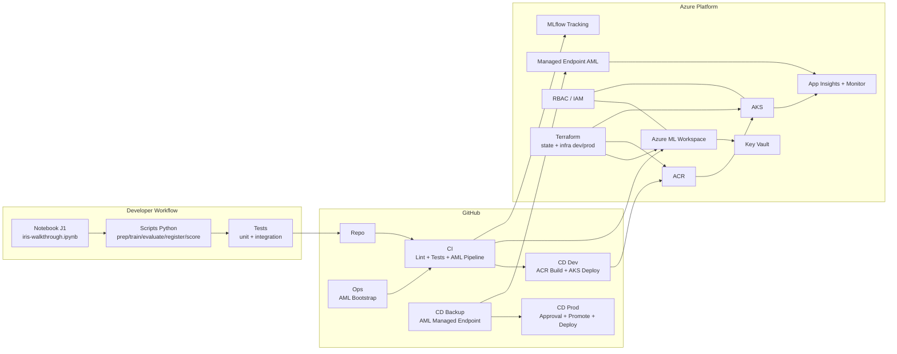
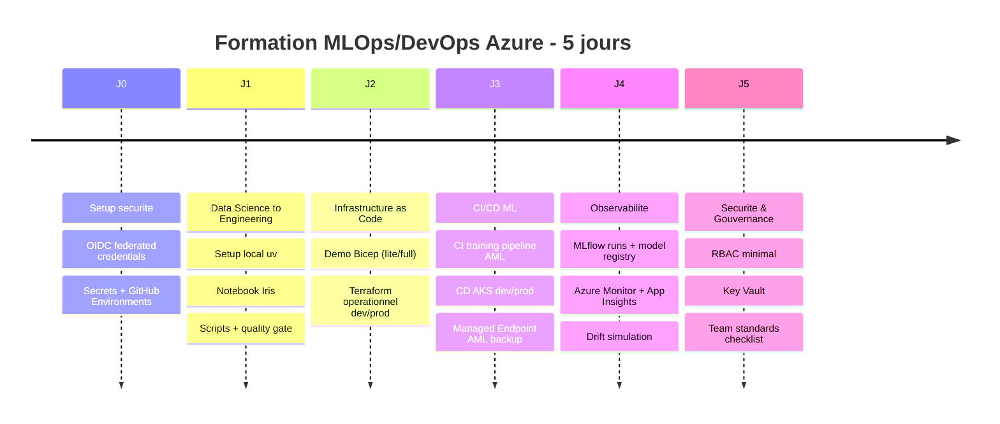
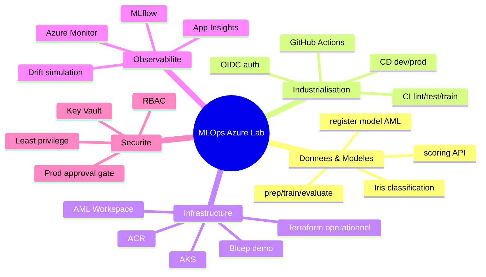
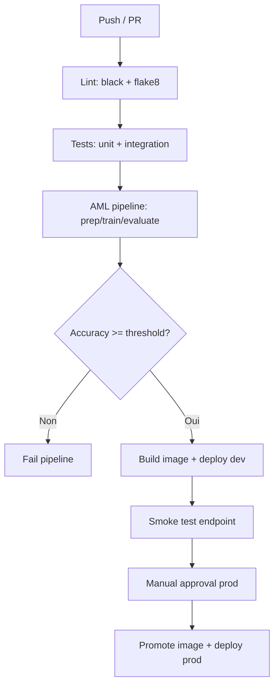

# Infographie — MLOps Azure Lab (Themes, Notions, Technos)

Sources visuelles:
- Editable Excalidraw: `docs/infographie-mlops-lab.excalidraw`
- Export PNG: `docs/infographie-mlops-lab.png`

## 1) Vue d'Ensemble Architecture

## 2) Progression Pedagogique (J0 -> J5)

## 3) Carte Notions -> Technos

## 4) Gates de Qualite

## 5) Matrice Competences
| Theme | Notions cle | Outils / artefacts |
|---|---|---|
| MLOps fundamentals | train/eval/register/serve | `mlops/data-science/src/*` |
| Reproductibilite | lock dependencies, tests, lint | `requirements.in`, `requirements.txt`, `tests/`, CI |
| IaC | demo vs operationnel, state | `infrastructure/bicep/`, `infrastructure/terraform/` |
| CI/CD | environments, promotion, gates | `.github/workflows/*.yml` |
| Observabilite | metrics, logs, drift | MLflow, App Insights, `scripts/generate-drift.py` |
| Securite | OIDC, RBAC, secrets | `lab/lab0-setup.md`, `scripts/setup-rbac.sh`, Key Vault |
