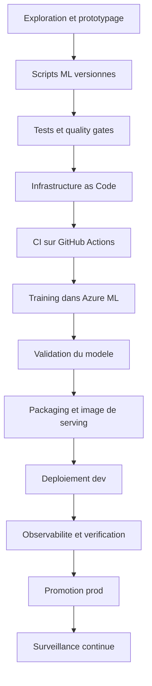

# Workflow global d'un projet MLOps sur Azure

[Home](./Home.md) | [Vision MLOps Cloud sur Azure](./01-vision-mlops-cloud.md)

## Pourquoi cette page existe

Cette page donne la vue d'ensemble.
Le but n'est pas de refaire les labs et encore moins de commenter chaque script.
Le but est d'expliquer le workflow global d'un projet ML deploye sur Azure avec de bonnes pratiques.

## Vue bout en bout

## Les grandes phases

| Phase | Question a resoudre | Bonne pratique |
|---|---|---|
| Prototyper | Le modele fonctionne-t-il ? | Commencer en notebook, mais sortir vite vers des scripts |
| Industrialiser le code | Peut-on relancer le pipeline de facon fiable ? | Separer `prep`, `train`, `evaluate`, `score` |
| Industrialiser l'infra | Peut-on recreer le meme environnement ? | Utiliser Bicep ou Terraform, pas le portail a la main |
| Automatiser | Comment eviter les manipulations manuelles ? | Mettre la CI/CD dans le repo |
| Deployer | Comment exposer la prediction ? | Choisir AKS ou AML Managed Endpoint selon le besoin |
| Exploiter | Comment savoir si ca marche encore ? | Logs, metrics, alertes, suivi du drift |

## Le vrai changement de posture

Pour beaucoup de profils data, le changement est celui-ci :

- avant, on cherche surtout a produire un bon modele
- ensuite, on doit produire un systeme ML fiable

Cela ajoute de nouvelles questions :

- qui deploie ?
- sur quel environnement ?
- comment on refait un run ?
- comment on sait qu'un changement n'a rien casse ?
- comment on observe un endpoint apres mise en ligne ?

## Pourquoi Azure + GitHub est une combinaison frequente

| Besoin | Service / outil dans ce repo | Pourquoi c'est utile |
|---|---|---|
| Execution ML | Azure Machine Learning | Standardiser les jobs et les artefacts |
| Registry d'images | Azure Container Registry | Stocker les images de serving |
| Serving conteneurise | AKS | Garder un controle fort sur le runtime |
| Serving gere | AML Managed Endpoint | Accelerer la mise en service |
| Observabilite | Application Insights + Azure Monitor | Voir erreurs, trafic et alertes |
| Authentification pipeline | GitHub OIDC + Entra ID | Eviter les secrets statiques |
| Automatisation | GitHub Actions | Versionner la CI/CD avec le code |

## Ce qu'il faut retenir

Le workflow global d'un projet MLOps sur Azure n'est pas :
"j'entraine puis je clique sur deploy".

Le workflow global est plutot :

1. rendre le code relancable
2. verifier automatiquement sa qualite
3. provisionner un environnement cible propre
4. executer l'entrainement dans une plateforme standardisee
5. choisir une strategie de serving adaptee
6. observer le comportement en continu

## Navigation

- Suite: [Vision MLOps Cloud sur Azure](./01-vision-mlops-cloud.md)
