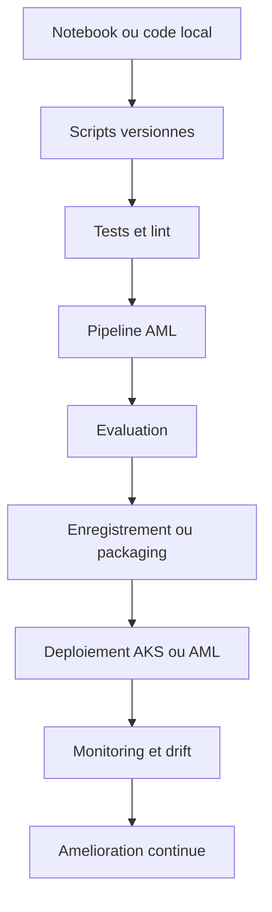

# Vision MLOps Cloud sur Azure

[Home](./Home.md) | [Workflow global d'un projet MLOps sur Azure](./00-workflow-global-azure-mlops.md) | [Architecture du repo](./02-architecture-du-repo.md)

## Ce que veut dire "faire du MLOps dans le cloud"

Le MLOps consiste a industrialiser un cycle de vie ML qui ne s'arrete pas a l'entrainement :

- preparer les donnees
- entrainer et evaluer
- versionner les artefacts utiles
- deployer un service de prediction
- observer ce service en production
- faire evoluer le modele et l'infrastructure sans casser l'existant

Dans le cloud, on cherche en plus a separer clairement :

- le code applicatif
- l'infrastructure
- les identites et permissions
- les environnements
- les pipelines d'automatisation

## Message cle

Le sujet principal n'est pas "comment lancer un modele sur Azure".
Le sujet principal est "comment rendre un systeme ML reproductible, deployable, observable et gouvernable".

## Si tu viens de la data science

Le changement de perspective le plus important est souvent celui-ci :

- en data science, on optimise surtout l'experimentation
- en MLOps, on optimise aussi la reproductibilite, la mise en service et la maintenance

Autrement dit :
- un notebook utile n'est pas encore un produit exploitable
- un bon score offline n'est pas encore une mise en production reussie

## Comment ce repo materialise cette vision

Le depot suit une logique en couches :

- `mlops/data-science/` contient le code ML, le serveur de scoring et l'environnement d'execution
- `mlops/pipelines/` contient les definitions AML et le manifest de deploiement AKS
- `.github/workflows/` contient l'orchestration CI/CD
- `infrastructure/bicep/` et `infrastructure/terraform/` provisionnent Azure
- `scripts/` fournit des operations transverses comme le bootstrap AML, le RBAC ou la simulation de drift

## Chaine de valeur MLOps du repo

## Pourquoi Azure est pertinent ici

Azure apporte plusieurs briques qui couvrent les besoins MLOps sans tout reconstruire soi-meme :

- Azure Machine Learning pour les jobs, les endpoints et le registre de modeles du workspace
- Azure Kubernetes Service pour le serving conteneurise et la maitrise de l'execution
- Azure Container Registry pour stocker les images de serving
- Key Vault pour les secrets et la centralisation des references sensibles
- Application Insights et Azure Monitor pour la telemetrie et les alertes
- Microsoft Entra ID pour l'identite federée et le RBAC

## Lecture entreprise

Pour une organisation, Azure n'apporte pas seulement des services techniques.
Azure apporte surtout un cadre coherent pour :

- maitriser les identites
- separer les environnements
- tracer les changements
- standardiser les deploiements
- brancher le ML sur les pratiques DevOps existantes

## Ce qu'il faut retenir au debut

Si tu debutes en MLOps, il n'est pas necessaire de tout maitriser d'un coup.
Dans ce repo, il suffit d'abord de comprendre ces 5 idees :

1. le code ML doit devenir un script reproductible
2. ce script doit etre teste automatiquement
3. l'infrastructure cloud doit etre decrite comme du code
4. le deploiement doit etre automatisable
5. le modele doit etre observable apres mise en service

## Du prototype au produit

| Quand on debute en DS | Ce qu'il faut ajouter en MLOps |
|---|---|
| Notebook local | Scripts relancables |
| Bon score offline | Quality gate automatise |
| Fichiers locaux | Artefacts traces et versionnes |
| Manipulations manuelles | Pipelines CI/CD |
| Test ponctuel | Observabilite continue |

## Le principe cle : tout traiter comme un systeme

Dans un projet ML immature, l'equipe pense souvent en une seule question :
"le modele est-il bon ?"

Dans un projet MLOps, il faut aussi repondre a ces questions :

- qui peut deployer ?
- sur quelle infra ?
- comment reproduire l'entrainement ?
- ou sont les logs ?
- comment on promeut `dev` vers `prod` ?
- que se passe-t-il si le endpoint tombe ou si les donnees changent ?

Ce repo est utile parce qu'il montre que le MLOps n'est pas un outil unique.
C'est l'assemblage coherent de pratiques DevOps, Data et plateforme cloud.

## Point d'attention

Une erreur frequente en formation consiste a reduire le MLOps a AML ou a Kubernetes.
Ici, il faut insister sur le fait que la valeur vient de l'ensemble :
code, pipeline, infra, identite, deploiement, monitoring et gouvernance.

## Navigation

- Precedent: [Workflow global d'un projet MLOps sur Azure](./00-workflow-global-azure-mlops.md)
- Suite: [Architecture du repo](./02-architecture-du-repo.md)
