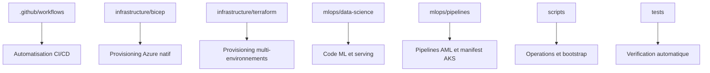

# Architecture du repo

[Home](./Home.md) | [Vision MLOps Cloud sur Azure](./01-vision-mlops-cloud.md) | [CI/CD GitHub Actions + Azure](./03-ci-cd-github-actions-azure.md)

## Vue d'ensemble

Le depot est structure pour separer les responsabilites.
Cette separation est un point central en MLOps : on evite de melanger code ML, infra,
deploiement et documentation dans un seul bloc difficile a maintenir.

## Message cle

Un bon repo MLOps n'est pas juste un repo de notebooks.
C'est un repo qui rend visible le partage des responsabilites entre data, plateforme et exploitation.

## Comment lire ce repo quand on debute

Si le depot parait dense, ne le lis pas dossier par dossier sans fil conducteur.
La bonne approche est :

1. commencer par le code ML
2. voir comment ce code est teste
3. regarder comment il est execute dans Azure ML
4. comprendre ensuite comment il est deploye
5. seulement apres, revenir sur l'infrastructure detaillee

## Dossiers principaux

### `mlops/data-science/`

Contient le coeur du code ML :

- `src/prep.py` prepare les donnees
- `src/train.py` entraine le modele
- `src/evaluate.py` applique un quality gate
- `src/register.py` enregistre le modele dans Azure ML
- `src/score.py` et `server.py` servent la prediction
- `Dockerfile` construit l'image de serving
- `environment/train-env.yml` decrit l'environnement AML de training

Lecture MLOps :
- le notebook n'est pas la cible finale
- les etapes critiques sont converties en scripts versionnes et testables
- le code de science des donnees devient un composant industrialisable

Ce que tu dois regarder en premier :
- comment `prep.py`, `train.py` et `evaluate.py` decoupent le travail
- comment la logique du notebook est rendue executable sans interface manuelle

### `mlops/pipelines/`

Contient les definitions de pipeline et de serving :

- `pipeline.yml` decrit un pipeline AML avec `prep_data`, `train_model`, `evaluate_model`
- `online-endpoint.yml` decrit l'endpoint AML gere
- `online-deployment.yml` decrit son deployment
- `aks-deployment.yml` decrit l'application Kubernetes de scoring

Lecture MLOps :
- on separe le "train pipeline" du "serving deployment"
- on distingue deux strategies de serving : AML managed endpoint et AKS
- on rend les choix d'orchestration explicites et auditable

Ce que tu dois retenir :
- un pipeline ML n'est pas seulement "train"
- il faut penser aussi a "comment je sers le modele ensuite"

### `.github/workflows/`

Contient l'automatisation GitHub Actions :

- `ci-train.yml` pour la qualite et l'entrainement AML
- `cd-deploy-dev.yml` pour le build image et le deploiement AKS en dev
- `cd-deploy-prod.yml` pour la promotion et le deploiement prod
- `cd-deploy-aml-endpoint.yml` pour le chemin Managed Endpoint AML
- `ops-bootstrap-aml.yml` pour preparer les assets AML

Lecture MLOps :
- les workflows remplacent le "runbook manuel"
- la CI/CD devient un actif versionne du projet
- l'automatisation n'est plus dans un portail opaque, elle vit avec le code

Si tu n'as jamais fait de CI/CD :
- lis ces workflows comme des recettes automatiques
- chaque job correspond a une action qu'une equipe ferait sinon a la main

### `infrastructure/bicep/` et `infrastructure/terraform/`

Deux approches d'Infrastructure as Code coexistent :

- `bicep/` pour une lecture Azure-native, simple et pedagogique
- `terraform/` pour une approche plus operationnelle et multi-environnements

Lecture MLOps :
- l'infrastructure ML doit etre reproductible comme le code applicatif
- le workspace AML, ACR, AKS et Key Vault ne doivent pas etre crees a la main
- le passage demo Bicep puis operationnel Terraform aide a expliquer deux niveaux de maturite

Si l'infra te semble abstraite :
- retiens d'abord que ces fichiers servent a recreer le meme environnement proprement
- l'objectif n'est pas de memoriser toute la syntaxe Bicep ou Terraform

### `tests/`

Contient les tests Python et d'integration locale.

Lecture MLOps :
- un projet ML sans tests n'est pas industrialise
- l'automatisation commence par la verification systematique des scripts critiques

### `lab/`

Contient la progression pedagogique du lab sur plusieurs jours.

Lecture MLOps :
- utile pour comprendre l'ordre logique : setup, code ML, infra, CI/CD, observabilite, gouvernance

## Architecture logique

On peut lire le repo comme une chaine :

1. Le code source et les tests vivent dans Git.
2. GitHub Actions orchestre les verifications et les deploiements.
3. Azure ML execute le pipeline de training.
4. ACR stocke l'image de serving.
5. AKS ou AML expose le modele.
6. App Insights et Azure Monitor permettent d'observer le comportement du systeme.

Cette lecture "de bout en bout" est la bonne maniere d'expliquer le depot a une equipe.

## Lecture pedagogique

Pour presenter ce repo, il est utile de suivre cet ordre :

1. code ML
2. pipeline AML
3. workflows GitHub
4. infrastructure Azure
5. serving et monitoring

Cet ordre aide a montrer comment on passe du besoin metier a l'exploitation reelle.

## Mini-resume

Pour un data scientist ou un ML engineer junior, ce repo montre surtout comment un projet ML devient :

- testable
- automatisable
- deployable
- observable

## Carte du depot

## Navigation

- Precedent: [Vision MLOps Cloud sur Azure](./01-vision-mlops-cloud.md)
- Suite: [CI/CD GitHub Actions + Azure](./03-ci-cd-github-actions-azure.md)
