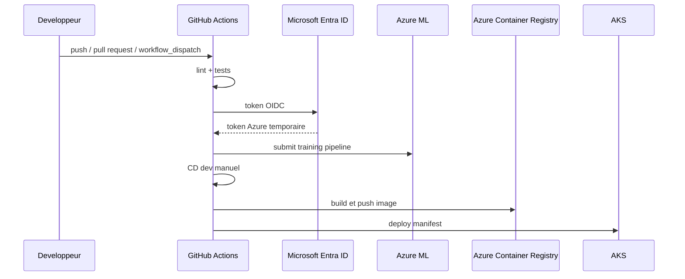

# CI/CD GitHub Actions + Azure

[Home](./Home.md) | [Architecture du repo](./02-architecture-du-repo.md) | [Serving, observabilite et gouvernance](./04-serving-observabilite-gouvernance.md)

## Le principe

Le repo utilise GitHub Actions comme moteur d'automatisation.
Azure sert de plateforme d'execution et de deploiement.
L'ensemble est relie proprement par OIDC, donc sans secret statique Azure dans GitHub.

## Avant de rentrer dans les workflows

Quand on debute, on peut voir la CI/CD comme une sorte de "systeme de verification et de livraison".

- la CI dit: "est-ce que le changement est acceptable techniquement ?"
- la CD dit: "si oui, comment le livrer proprement dans un environnement ?"

Dans un projet ML, cela couvre a la fois:

- le code Python
- le pipeline d'entrainement
- l'image de serving
- le deploiement cloud
- les regles de promotion entre environnements

## Message cle

Ici, la CI/CD n'est pas une couche annexe.
Elle est le mecanisme qui relie le code, l'infrastructure, l'identite cloud et les environnements de deploiement.

## Si tu n'as jamais vraiment utilise la CI/CD

Tu peux lire cette page avec une idee simple :

- la CI verifie automatiquement qu'un changement ne casse pas le projet
- la CD automatise le deploiement quand les conditions sont reunies

Dans ce repo, cela veut dire concretement :

- verifier le code Python
- lancer les tests
- soumettre un pipeline AML
- construire une image de serving
- deployer sur Azure

## Ce qui change par rapport a un projet logiciel "classique"

Dans un projet applicatif classique, la CI/CD verifie surtout:

- la qualite du code
- les tests
- la construction d'un binaire ou d'une image

Dans un projet ML, il faut ajouter:

- l'execution d'un pipeline d'entrainement
- l'evaluation du modele
- parfois le versioning d'artefacts ML
- parfois des conditions de promotion liees a des metriques

Cela explique pourquoi la CI/CD d'un projet ML peut sembler plus lourde:
- elle ne livre pas seulement du code
- elle livre un comportement de prediction qu'il faut aussi verifier

## Pourquoi on fait cette automatisation

| Sans CI/CD | Avec CI/CD |
|---|---|
| On rerun a la main quand on pense a le faire | Chaque changement important repasse par des verifications |
| On oublie facilement une etape | Les etapes sont encodees dans le workflow |
| Les resultats dependent de la machine de chacun | L'execution est plus standardisee |
| Le deploiement repose sur la memoire de l'equipe | Le processus devient lisible et repetable |

## Vue d'ensemble du flux CI/CD

## Lecture du schema

Ce schema montre trois idees importantes:

- GitHub Actions n'accede pas directement a Azure avec un mot de passe stocke
- le pipeline d'entrainement et le deploiement applicatif sont deux etapes distinctes
- le deploiement `dev` n'est pas automatique dans ce lab, il est volontairement manuel apres verification

## CI : verifier puis entrainer

Le workflow [`.github/workflows/ci-train.yml`](../../.github/workflows/ci-train.yml) fait trois choses :

1. verifier le style et le formatage
2. executer les tests
3. soumettre un pipeline AML

Le pipeline AML lui-meme est dans [`mlops/pipelines/pipeline.yml`](../../mlops/pipelines/pipeline.yml).
Il orchestre trois jobs :

- preparation des donnees
- entrainement
- evaluation

Point important :
- la CI ne s'arrete pas au code Python local
- elle valide aussi la capacite a faire tourner le workflow ML dans Azure ML

Lecture entreprise :
- cela montre qu'un pipeline ML doit etre teste aussi dans son contexte d'execution cible
- un script qui marche localement n'est pas encore un actif exploitable

Si tu viens du notebook :
- pense a la CI comme a un collegue automatique qui rerun les verifications a chaque changement
- pense a AML comme a l'endroit ou l'entrainement est execute de facon standardisee

## Pourquoi faire tourner aussi AML dans la CI

Si on ne faisait que:

- `black`
- `flake8`
- `pytest`

on validerait seulement la partie locale du projet.

Le repo va plus loin:

- il valide aussi que l'environnement AML, le compute et le pipeline cloud fonctionnent reellement

Bonne pratique:

- quand un systeme depend d'un service cloud critique, il faut tester aussi ce service dans le flux de verification

Point de branche:
- dans ce repo, les declenchements automatiques `push` sont volontairement attaches a `dev`
- `main` reste une branche de reference synchronisee et de validation via `pull_request`
- cela evite de dupliquer les runs CI/CD sur deux branches qui portent le meme contenu

## CD dev : construire puis deployer

Le workflow [`.github/workflows/cd-deploy-dev.yml`](../../.github/workflows/cd-deploy-dev.yml) illustre une logique classique :

1. attendre une CI reussie
2. reconstruire un artefact modele local
3. construire l'image de serving avec le `Dockerfile`
4. pousser l'image dans Azure Container Registry
5. injecter les valeurs dynamiques dans le manifest Kubernetes
6. deployer sur AKS

Dans le lab actuel, le `CD dev` est lance **manuellement** apres verification du resultat de la CI.
Ce choix est volontaire:

- le pipeline AML prend deja plusieurs minutes
- on ne veut pas rebuild et redeployer AKS a chaque push de test
- cela rend la demonstration plus lisible et plus proche d'un gate de promotion vers `dev`

Point important :
- l'image de serving embarque un modele construit pendant le workflow
- cela montre une logique simple de bout en bout
- dans le repo, l'image AKS utilise maintenant un runtime de serving dedie, separe des dependances de training/MLflow
- cette separation evite des conflits de dependances dans l'image de serving et reflete mieux une architecture reelle

Ce que tu dois comprendre ici :
- deploiement ne veut pas dire seulement "copier du code"
- il faut aussi preparer le runtime qui va exposer la prediction

## Pourquoi le CD dev reste manuel ici

Ce choix est pedagogique mais aussi raisonnable techniquement.

Si on declenchait automatiquement le CD a chaque push `dev`:

- le lab serait plus lent
- on consommerait plus de ressources Azure et GitHub Actions
- on masquerait la distinction entre "j'ai un entrainement valide" et "je veux vraiment redeployer un service"

La bonne lecture est donc:

- la CI verifie et entraine
- l'humain regarde
- puis le CD dev deploie si cela a du sens

Ce n'est pas une limitation.
C'est un exemple de gate de promotion simplifie.

## AKS et Managed Endpoint AML ne jouent pas le meme role

Le repo montre deux cibles de deploiement differentes :

| Cible | Workflow | Ce que cela produit | Utilite principale |
|---|---|---|---|
| `AKS` | [`.github/workflows/cd-deploy-dev.yml`](../../.github/workflows/cd-deploy-dev.yml) | une application de scoring conteneurisee sur Kubernetes | serving applicatif + App Insights |
| `Managed Endpoint AML` | [`.github/workflows/cd-deploy-aml-endpoint.yml`](../../.github/workflows/cd-deploy-aml-endpoint.yml) | un modele enregistre dans AML + un endpoint gere | registre de modeles + serving ML gere |

Point cle:
- le deploiement `AKS` n'enregistre pas automatiquement le modele dans le registre AML
- le workflow `Managed Endpoint AML` enregistre `iris-classifier` dans le workspace AML
- c'est pour cela que le versioning de modele du Jour 4 depend du workflow Managed Endpoint, pas du deploiement AKS

## Comment choisir entre les deux, en pratique

Il ne faut pas les opposer comme "bonne" et "mauvaise" solution.

La vraie question est:

- qui veut controler le runtime ?
- qui exploite le service ?
- ou veut-on porter la complexite ?

En pratique:

- `AKS` convient bien si l'organisation a deja une culture Kubernetes et veut une logique applicative homogene
- `Managed Endpoint AML` convient bien si l'equipe veut rester plus pres d'une plateforme ML geree

## Separation recommandee des environnements

## CD prod : promotion controlee

Le workflow [`.github/workflows/cd-deploy-prod.yml`](../../.github/workflows/cd-deploy-prod.yml) ajoute deux controles utiles :

- une confirmation explicite via `CONFIRM`
- une protection GitHub Environment `production`

Il ne rebuild pas depuis zero.
Il recupere l'image la plus recente depuis l'ACR dev, l'importe dans l'ACR prod, puis deploie sur AKS prod.

Lecture MLOps :
- on cherche a promouvoir un artefact deja produit, pas a recompiler differemment en prod
- c'est plus proche d'une vraie logique de release

Lecture entreprise :
- la prod doit etre une promotion controlee, pas un environnement "special" reconstruit differemment
- cette logique simplifie l'auditabilite et reduit les ecarts entre environnements

Version simple :
- `dev` sert a tester rapidement
- `prod` demande plus de controle
- on essaie de promouvoir quelque chose qui existe deja, pas de refaire autrement

## Bonne pratique cle pour la prod

Une mauvaise pratique frequente consiste a reconstruire differemment en prod.

Ce repo montre l'idee inverse:

- on produit un artefact
- on le valide
- on le promeut

Pourquoi c'est important:

- on reduit les ecarts entre `dev` et `prod`
- on rend les releases plus auditables
- on limite les "surprises de production"

## OIDC : le point de securite le plus important

Le repo s'appuie sur `azure/login@v2` avec :

- `AZURE_CLIENT_ID`
- `AZURE_TENANT_ID`
- `AZURE_SUBSCRIPTION_ID`

Le secret important ici n'est pas un mot de passe Azure.
L'authentification s'appuie sur une App Registration et des Federated Credentials.

Cela signifie :

- pas de secret longue duree a stocker dans GitHub
- tokens temporaires
- contexte d'usage borne par branche ou environment

En pratique, c'est un excellent exemple moderne a montrer dans un wiki MLOps cloud.

## Point d'attention

Le point le plus important a faire passer en formation est souvent celui-ci :
l'identite du pipeline compte autant que le code du pipeline.
Sans modele propre d'authentification et de permissions, la CI/CD devient fragile ou dangereuse.

Si les notions d'OIDC, App Registration ou Federated Credentials sont nouvelles :
- retiens surtout que le pipeline s'authentifie a Azure sans stocker de mot de passe longue duree
- c'est une bonne pratique moderne a connaitre tres tot

## Ce qu'il faut comparer mentalement

| Ancienne habitude | Approche recommandee ici |
|---|---|
| stocker un secret de service principal dans GitHub | utiliser OIDC avec token temporaire |
| donner des droits larges "pour etre tranquille" | donner des droits limites au bon scope |
| deployer a la main depuis son poste | laisser le pipeline porter l'action |

Cette comparaison est importante parce qu'elle montre que la CI/CD n'est pas seulement une question de confort.
C'est aussi une question de securite et de gouvernance.

## Pourquoi cette approche parle aussi aux equipes Azure DevOps

La logique est exactement celle d'un pipeline d'entreprise classique :

- un evenement Git declenche une automation
- l'automation execute des jobs ordonnes
- certains jobs produisent des artefacts
- des garde-fous controlent la promotion vers la prod
- l'authentification cloud est geree par une identite de pipeline

La difference visible est surtout dans l'outil, pas dans le modele d'exploitation.

## Bootstrap AML

Le workflow [`.github/workflows/ops-bootstrap-aml.yml`](../../.github/workflows/ops-bootstrap-aml.yml)
et le script [`scripts/bootstrap-aml.sh`](../../scripts/bootstrap-aml.sh) servent a initialiser ou reparer
les assets AML utiles au lab.

Lecture MLOps :
- tout ce qui est repetitif ou fragile doit devenir scriptable
- un bon systeme cloud evite les operations manuelles irreproductibles

## Liens avec les labs

- [Jour 3](../../lab/jour3.md) montre l'execution concrete de cette page
- [Jour 4](../../lab/jour4.md) montre ce qu'on observe apres deploiement
- [Jour 5](../../lab/jour5.md) montre comment relier CI/CD et gouvernance

## Navigation

- Precedent: [Architecture du repo](./02-architecture-du-repo.md)
- Suite: [Serving, observabilite et gouvernance](./04-serving-observabilite-gouvernance.md)
