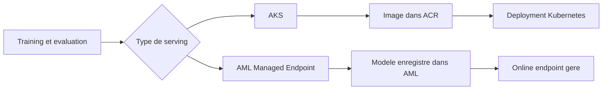
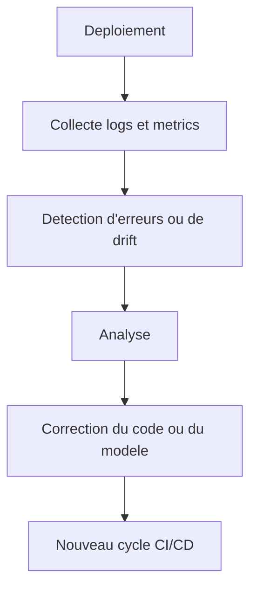

# Serving, observabilite et gouvernance

[Home](./Home.md) | [CI/CD GitHub Actions + Azure](./03-ci-cd-github-actions-azure.md) | [GitHub Actions vs Azure DevOps](./05-github-actions-vs-azure-devops.md)

## Deux modes de serving dans ce repo

Le depot montre volontairement deux chemins de serving.

## Avant de parler de serving

Une confusion frequente chez les debutants est la suivante:

- "j'ai entraine un modele" serait equivalent a "mon service est en production"

Ce n'est pas le cas.

Entre un modele entraine et un service utilisable, il faut encore:

- definir un contrat d'entree et de sortie
- choisir un runtime d'execution
- gerer des dependances
- exposer un endpoint
- superviser ce endpoint
- traiter les droits d'acces et les secrets

## Message cle

Le choix d'une cible de serving n'est pas seulement technique.
Il traduit aussi une repartition de responsabilites entre equipe ML, equipe plateforme et operations.

## Si tu decouvres le serving

Le serving, c'est simplement la facon de rendre ton modele utilisable par une autre application.
Dans ce repo, cela passe par un endpoint qui recoit des donnees et renvoie une prediction.

## Les 3 questions a se poser avant de choisir un mode de serving

1. Qui exploite le runtime au quotidien ?
2. Veut-on surtout de la flexibilite ou surtout de la simplicite ?
3. Souhaite-t-on raisonner comme une plateforme applicative ou comme une plateforme ML geree ?

## Choisir entre AKS et AML Managed Endpoint

| Question | AKS | AML Managed Endpoint |
|---|---|---|
| Je veux controler finement le runtime | Oui | Moins |
| Je veux aller plus vite au debut | Moins | Oui |
| Mon equipe connait deja Kubernetes | Oui | Pas necessaire |
| Je veux un service ML plus gere | Moins | Oui |

## Option 1 : serving sur AKS

Avec AKS, l'equipe deploie une application conteneurisee classique :

- image stockee dans ACR
- manifest Kubernetes dans [`mlops/pipelines/aks-deployment.yml`](../../mlops/pipelines/aks-deployment.yml)
- service expose via `LoadBalancer`

Ce choix est pertinent quand on veut :

- controler finement le runtime
- rester proche des pratiques plateforme Kubernetes
- mutualiser avec d'autres workloads applicatifs

Contrepartie :
- plus de responsabilite d'exploitation
- plus de details a gerer sur le cluster

Lecture entreprise :
- AKS convient bien quand l'organisation a deja une culture Kubernetes forte
- c'est souvent le bon choix quand le serving ML doit s'inserer dans une plateforme applicative plus large

Version simple :
- AKS = plus de controle, plus de responsabilite

## Ce que cela implique concretement sur AKS

Quand on choisit AKS, on prend en charge explicitement:

- l'image Docker
- le manifest Kubernetes
- le rollout
- le service expose
- l'instrumentation applicative

Bonne pratique:

- utiliser un runtime de serving dedie
- separer les dependances de training et de serving

Le repo l'illustre maintenant explicitement:

- la pile de training garde ses dependances ML
- la pile AKS de serving utilise un fichier de dependances plus leger et plus stable

## Option 2 : Managed Online Endpoint dans Azure ML

Avec AML Managed Endpoint, Azure gere davantage de choses pour l'equipe :

- endpoint gere par Azure ML
- deployment associe a un modele enregistre
- invocation via les commandes `az ml online-endpoint`

Ce chemin est pratique quand on veut :

- rester dans un paradigme plus "ML platform"
- lier plus naturellement entrainement, registre de modeles et serving
- reduire la charge d'exploitation Kubernetes

Lecture entreprise :
- AML Managed Endpoint convient bien aux equipes qui veulent accelerer la mise en service sans porter toute la couche runtime
- c'est souvent plus simple pour une equipe data platform que pour une equipe infra generaliste

Version simple :
- AML Managed Endpoint = moins d'infra a gerer, plus de choses prises en charge par Azure

## Ce que cela simplifie reellement

Avec un Managed Endpoint, Azure prend davantage en charge:

- une partie du runtime de serving
- le cycle endpoint / deployment
- l'integration avec les assets AML

Mais cela ne veut pas dire "plus aucune question technique".
Il faut encore:

- un environnement d'inference correct
- un `score.py` compatible
- un modele correctement package
- des quotas suffisants

## Pourquoi montrer les deux

C'est pedagogiquement utile parce que beaucoup d'equipes hesitent entre :

- une approche plateforme applicative
- une approche plateforme ML geree

Le repo montre que ces deux mondes peuvent coexister.
Le bon choix depend moins de la "purete technique" que de l'organisation cible.

## Resume decisionnel

| Si ton besoin ressemble a... | Le chemin le plus naturel est souvent... |
|---|---|
| "je veux un service HTTP integre a une plateforme Kubernetes" | `AKS` |
| "je veux rester au plus pres d'une experience Azure ML geree" | `Managed Endpoint AML` |
| "je veux comprendre la difference entre une app de scoring et un service ML gere" | les deux, comme dans ce repo |

## Deux chemins de serving



## Observabilite

Le lab met en avant plusieurs dimensions :

- suivi des runs et des artefacts dans Azure ML
- Application Insights pour la telemetrie du service
- Azure Monitor pour les alertes
- script de drift pour simuler des comportements anormaux

## Bien distinguer les niveaux d'observation

Le mot "observabilite" recouvre plusieurs choses qu'il faut separer:

| Niveau | Ce qu'on regarde | Exemple dans ce repo |
|---|---|---|
| applicatif | requetes HTTP, erreurs, latence | `Application Insights` |
| ML | runs, metriques, versions de modele | `Azure ML` |
| plateforme | pods, rollout, service expose | `AKS` / `kubectl` |
| gouvernance | qui a le droit d'agir | `RBAC`, `Entra ID`, `Key Vault` |

Cette distinction est essentielle pour les debutants:

- une requete `200` ne dit rien a elle seule sur la qualite du modele
- un bon score offline ne dit rien a lui seul sur la sante du service
- une alerte infra ne dit rien a elle seule sur un drift metier

Pour le chemin AKS du lab:
- l'application Flask de scoring envoie sa telemetrie HTTP vers `Application Insights`
- dans le portail Azure, le menu `Logs` ouvre generalement `Query Hub`
- c'est a cet endroit qu'on execute les requetes KQL pour verifier l'arrivee des `requests`

## Comment lire les signaux du Jour 4

Le Jour 4 ne montre pas un systeme complet de detection de drift metier.
Il montre plutot une progression logique:

1. le service AKS repond
2. les requetes arrivent bien dans App Insights
3. on sait interroger la telemetrie via KQL
4. on comprend qu'il faudra aller plus loin pour un vrai monitoring metier

Cette nuance est importante:

- App Insights observe surtout le trafic et la sante applicative
- le drift metier demande en general des indicateurs supplementaires sur les donnees et les predictions

Requetes KQL utiles:

Requetes recentes:
```kusto
requests
| where timestamp > ago(30m)
| order by timestamp desc
| take 20
```

Succes / codes HTTP:
```kusto
requests
| where timestamp > ago(30m)
| summarize count() by success, resultCode
```

Volume dans le temps:
```kusto
requests
| where timestamp > ago(30m)
| summarize count() by bin(timestamp, 5m), success
| order by timestamp desc
```

Traces recentes:
```kusto
traces
| where timestamp > ago(30m)
| order by timestamp desc
| take 20
```

Lecture MLOps :
- observer un modele en prod ne se limite pas a regarder la latence
- il faut suivre aussi les erreurs, les patterns d'entree et les changements de comportement

Point important sur le drift:
- dans ce lab, le script de drift envoie des donnees anormales, mais l'API peut continuer a repondre en `200`
- un drift metier n'implique donc pas forcement une erreur technique HTTP
- App Insights permet ici de verifier que le trafic arrive bien, puis d'analyser la telemetrie
- pour un vrai suivi de drift metier, il faudrait aussi suivre la distribution des predictions et des features

Si tu es junior, retiens ceci :
- mettre un modele en ligne n'est pas la fin du travail
- apres le deploiement, il faut verifier que le service repond bien et que les entrees restent coherentes

## Anti-patterns frequents a expliquer en formation

- confondre "monitoring HTTP" et "monitoring ML"
- croire qu'un endpoint `200` suffit a valider la production
- ne pas distinguer la responsabilite de l'equipe ML et celle de l'equipe plateforme
- parler de gouvernance seulement a la fin

## Boucle d'exploitation



## Point d'attention

En formation, il faut bien separer :

- observabilite applicative
- observabilite ML
- gouvernance et controle d'acces

Ces trois sujets se croisent, mais ne se remplacent pas.

## Gouvernance

Le repo traite aussi des sujets souvent oublies dans les demos ML :

- RBAC Azure
- Key Vault
- separation `dev` / `prod`
- approbation manuelle avant la prod
- identities federees a la place des secrets persistants

Dans l'atelier `Jour 5`, le setup ne cree pas de groupe Entra ID dedie pour l'equipe.
L'exercice RBAC se fait donc:

- soit avec un groupe existant fourni pour la formation
- soit avec un groupe de test cree pour l'atelier puis supprime a la fin

Cela permet de separer clairement:

- l'identite technique du pipeline GitHub
- et les droits donnes a une equipe humaine MLOps

Ce sont des sujets de gouvernance parce qu'ils definissent :

- qui peut agir
- sur quoi
- dans quel contexte
- avec quel niveau de tracabilite

En entreprise, c'est souvent cela qui fait la difference entre une demo ML et une plateforme MLOps credible.

## Bonnes pratiques de gouvernance visibles dans ce repo

- utiliser OIDC plutot qu'un secret statique de service principal
- limiter les scopes RBAC au plus pres du besoin
- separer `dev` et `prod`
- exiger une action manuelle avant la promotion `prod`
- centraliser les secrets dans Key Vault

Ce ne sont pas des "details enterprise".
Ce sont des pratiques de base pour eviter qu'un projet ML soit impossible a maintenir proprement.

## Liens avec les labs

- [Jour 4](../../lab/jour4.md) montre la partie monitoring et KQL
- [Jour 5](../../lab/jour5.md) montre la partie RBAC, Key Vault et standards d'equipe

## Navigation

- Precedent: [CI/CD GitHub Actions + Azure](./03-ci-cd-github-actions-azure.md)
- Suite: [GitHub Actions vs Azure DevOps](./05-github-actions-vs-azure-devops.md)
