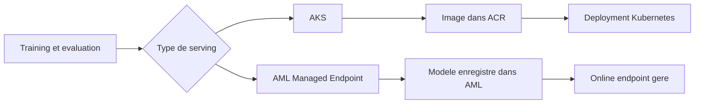
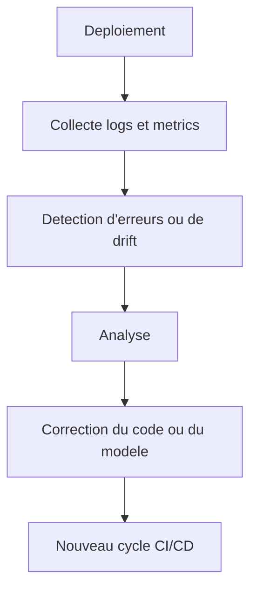

# Serving, observabilite et gouvernance

[Home](./Home.md) | [CI/CD GitHub Actions + Azure](./03-ci-cd-github-actions-azure.md) | [GitHub Actions vs Azure DevOps](./05-github-actions-vs-azure-devops.md)

## Deux modes de serving dans ce repo

Le depot montre volontairement deux chemins de serving.

## Message cle

Le choix d'une cible de serving n'est pas seulement technique.
Il traduit aussi une repartition de responsabilites entre equipe ML, equipe plateforme et operations.

## Si tu decouvres le serving

Le serving, c'est simplement la facon de rendre ton modele utilisable par une autre application.
Dans ce repo, cela passe par un endpoint qui recoit des donnees et renvoie une prediction.

## Choisir entre AKS et AML Managed Endpoint

| Question | AKS | AML Managed Endpoint |
|---|---|---|
| Je veux controler finement le runtime | Oui | Moins |
| Je veux aller plus vite au debut | Moins | Oui |
| Mon equipe connait deja Kubernetes | Oui | Pas necessaire |
| Je veux un service ML plus gere | Moins | Oui |

## Option 1 : serving sur AKS

Avec AKS, l'equipe deploie une application conteneurisee classique :

- image stockee dans ACR
- manifest Kubernetes dans [`mlops/pipelines/aks-deployment.yml`](../../mlops/pipelines/aks-deployment.yml)
- service expose via `LoadBalancer`

Ce choix est pertinent quand on veut :

- controler finement le runtime
- rester proche des pratiques plateforme Kubernetes
- mutualiser avec d'autres workloads applicatifs

Contrepartie :
- plus de responsabilite d'exploitation
- plus de details a gerer sur le cluster

Lecture entreprise :
- AKS convient bien quand l'organisation a deja une culture Kubernetes forte
- c'est souvent le bon choix quand le serving ML doit s'inserer dans une plateforme applicative plus large

Version simple :
- AKS = plus de controle, plus de responsabilite

## Option 2 : Managed Online Endpoint dans Azure ML

Avec AML Managed Endpoint, Azure gere davantage de choses pour l'equipe :

- endpoint gere par Azure ML
- deployment associe a un modele enregistre
- invocation via les commandes `az ml online-endpoint`

Ce chemin est pratique quand on veut :

- rester dans un paradigme plus "ML platform"
- lier plus naturellement entrainement, registre de modeles et serving
- reduire la charge d'exploitation Kubernetes

Lecture entreprise :
- AML Managed Endpoint convient bien aux equipes qui veulent accelerer la mise en service sans porter toute la couche runtime
- c'est souvent plus simple pour une equipe data platform que pour une equipe infra generaliste

Version simple :
- AML Managed Endpoint = moins d'infra a gerer, plus de choses prises en charge par Azure

## Pourquoi montrer les deux

C'est pedagogiquement utile parce que beaucoup d'equipes hesitent entre :

- une approche plateforme applicative
- une approche plateforme ML geree

Le repo montre que ces deux mondes peuvent coexister.
Le bon choix depend moins de la "purete technique" que de l'organisation cible.

## Deux chemins de serving

## Observabilite

Le lab met en avant plusieurs dimensions :

- suivi des runs et des artefacts dans Azure ML
- Application Insights pour la telemetrie du service
- Azure Monitor pour les alertes
- script de drift pour simuler des comportements anormaux

Lecture MLOps :
- observer un modele en prod ne se limite pas a regarder la latence
- il faut suivre aussi les erreurs, les patterns d'entree et les changements de comportement

Si tu es junior, retiens ceci :
- mettre un modele en ligne n'est pas la fin du travail
- apres le deploiement, il faut verifier que le service repond bien et que les entrees restent coherentes

## Boucle d'exploitation

## Point d'attention

En formation, il faut bien separer :

- observabilite applicative
- observabilite ML
- gouvernance et controle d'acces

Ces trois sujets se croisent, mais ne se remplacent pas.

## Gouvernance

Le repo traite aussi des sujets souvent oublies dans les demos ML :

- RBAC Azure
- Key Vault
- separation `dev` / `prod`
- approbation manuelle avant la prod
- identities federées a la place des secrets persistants

Ce sont des sujets de gouvernance parce qu'ils definissent :

- qui peut agir
- sur quoi
- dans quel contexte
- avec quel niveau de tracabilite

En entreprise, c'est souvent cela qui fait la difference entre une demo ML et une plateforme MLOps credible.

## Navigation

- Precedent: [CI/CD GitHub Actions + Azure](./03-ci-cd-github-actions-azure.md)
- Suite: [GitHub Actions vs Azure DevOps](./05-github-actions-vs-azure-devops.md)
