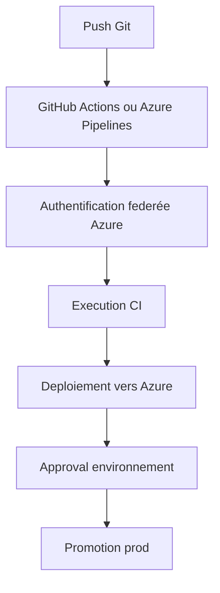

# GitHub Actions vs Azure DevOps

[Home](./Home.md) | [Serving, observabilite et gouvernance](./04-serving-observabilite-gouvernance.md)

## Le message principal

Ce repo utilise GitHub Actions, mais les concepts de fond sont tres proches d'Azure DevOps.
Pour une equipe qui vient d'Azure Pipelines, il faut expliquer la transposition, pas opposer artificiellement les deux mondes.

## Message cle

Le bon angle pedagogique n'est pas "quel outil est meilleur ?"
Le bon angle est "quels concepts restent stables quand on change d'outil ?"

## Pourquoi cette page est utile a un profil junior

Quand on debute, on peut vite croire qu'il faut reapprendre tout a chaque nouvel outil.
Cette page sert justement a montrer l'inverse :

- les noms changent
- les interfaces changent
- mais les grandes idees restent souvent les memes

## Equivalences principales

| Besoin | GitHub | Azure DevOps |
|---|---|---|
| Depot Git | GitHub repository | Azure Repos |
| Pipeline CI/CD | GitHub Actions | Azure Pipelines |
| Secrets / garde-fous | Secrets + Environments | Variable Groups + Environments + Service Connections |
| Auth Azure | OIDC via `azure/login` | Service Connection ou workload identity federation |
| Validation PR | Pull Requests | Pull Requests |
| Templates pipeline | Reusable workflows | YAML templates |
| Approval prod | GitHub Environment protection | Approvals and checks |

## Comment lire ce repo avec des lunettes Azure DevOps

### Workflow GitHub Actions = pipeline Azure Pipelines

Exemple :

- [`.github/workflows/ci-train.yml`](../../.github/workflows/ci-train.yml)

Equivalent conceptuel ADO :

- un `azure-pipelines.yml` avec stages `lint`, `test`, `train`

### GitHub Environment = environment + gate de deploiement

Ici :

- `dev`
- `production`

Equivalent ADO :

- environments Azure DevOps
- approbations et checks avant execution

### Secrets GitHub = variables securisees

Ici, les noms comme `AZURE_CLIENT_ID` ou `AML_WORKSPACE_DEV` sont stockes dans GitHub.

Equivalent ADO :

- variables de pipeline securisees
- variable groups
- parfois liaison Key Vault

### OIDC GitHub = alternative moderne aux Service Connections a secret

Le parallelle le plus utile a expliquer est celui-ci :

- dans GitHub, `azure/login` utilise un token OIDC emis par GitHub
- dans Azure DevOps moderne, on peut viser la meme idee avec workload identity federation

Le point important n'est pas l'outil.
Le point important est de sortir des secrets statiques.

## Correspondance de flux

## Differences pratiques

### Ce que GitHub fait bien dans ce repo

- tout est visible dans le meme espace que le code
- les workflows sont courts et lisibles
- l'integration avec PR, branches et environments est tres directe

### Ce qu'Azure DevOps fait souvent mieux en contexte entreprise historique

- portefeuille plus large quand l'organisation est deja dans ADO
- gouvernance pipeline souvent deja normalisee
- meilleure continuite quand Azure Repos, Boards et Pipelines sont deja la reference

## Lecture entreprise

Pour beaucoup d'equipes, le choix entre GitHub et Azure DevOps depend moins de la technique pure
que de l'organisation existante :

- gouvernance deja en place
- habitudes d'equipe
- niveau de centralisation voulu
- integration avec les autres outils du SI

Le repo est donc utile parce qu'il montre un modele transposable, pas un dogme d'outillage.

## Ce qu'il faut retenir

Si tu comprends deja ces correspondances, tu progresses vite :

- repository Git
- pipeline CI/CD
- secrets ou identites de pipeline
- environnements de deploiement
- validations avant la prod

## A ne pas faire

Cette page ne doit pas etre lue comme un duel d'outils.
Elle doit etre lue comme une aide de traduction :

- si tu connais GitHub, tu comprendras plus vite Azure DevOps
- si tu connais Azure DevOps, tu comprendras plus vite GitHub Actions

## Recommandation pedagogique

Pour expliquer ce repo a une audience mixte :

1. presenter d'abord les concepts MLOps independants de l'outil
2. montrer ensuite l'implementation GitHub du depot
3. terminer par la table de correspondance Azure DevOps

De cette maniere, on evite un faux debat "GitHub ou ADO ?".
La vraie question est plutot :
"comment automatiser proprement l'entrainement, le deploiement, la securite et la promotion dans notre contexte ?"

## Navigation

- Precedent: [Serving, observabilite et gouvernance](./04-serving-observabilite-gouvernance.md)
- Retour: [Home](./Home.md)
