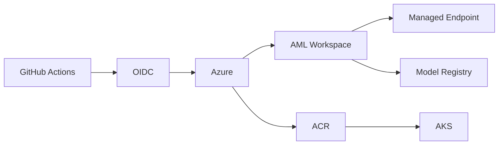

# Glossaire MLOps Azure

[Home](./Home.md) | [Workflow global d'un projet MLOps sur Azure](./00-workflow-global-azure-mlops.md)

## Pourquoi cette page existe

Le vocabulaire freine souvent plus que le code.
Cette page donne des definitions simples et utiles pour lire le repo sans supposer un bagage cloud avance.

## Glossaire

| Terme | Definition simple | A quoi ca sert dans ce repo |
|---|---|---|
| `Azure ML Workspace` | Espace de travail AML qui regroupe jobs, modeles, endpoints et assets | Point central pour le training et certains deploiements |
| `Pipeline AML` | Workflow de jobs executes dans Azure ML | Automatiser `prep`, `train`, `evaluate` |
| `Endpoint` | URL ou point d'entree qui expose le modele | Permet a une application de demander une prediction |
| `Deployment` | Version concrete d'un service associee a un endpoint | Mettre en ligne une implementation particuliere |
| `ACR` | Azure Container Registry | Stocker les images Docker |
| `AKS` | Azure Kubernetes Service | Faire tourner l'application de serving sur Kubernetes |
| `Managed Endpoint` | Endpoint gere par Azure ML | Eviter de gerer soi-meme toute la couche Kubernetes |
| `Artifact` | Fichier ou dossier produit par un job | Exemple: modele entraine, metrics, outputs |
| `Model Registry` | Catalogue de versions de modeles | Suivre et reutiliser les versions publiees |
| `IaC` | Infrastructure as Code | Decrire l'infra avec Bicep ou Terraform |
| `OIDC` | Federation d'identite entre GitHub et Azure | Authentifier le pipeline sans secret statique |
| `RBAC` | Role-Based Access Control | Donner les bons droits aux bonnes identites |
| `App Registration` | Identite applicative dans Entra ID | Representer le pipeline GitHub cote Azure |
| `Federated Credential` | Regle qui autorise GitHub a obtenir un token Azure | Limiter l'authentification a certains contexts |
| `Quality Gate` | Regle minimale a respecter | Exemple: accuracy minimale avant suite du flux |
| `Drift` | Changement dans les donnees ou le comportement du modele | Detecter qu'un modele reste peut-etre bon offline mais moins bon en production |

## Carte mentale rapide

## Ce qu'il faut retenir en priorite

Si tu debutes, concentre-toi d'abord sur ces notions :

- `pipeline`
- `artifact`
- `endpoint`
- `OIDC`
- `IaC`
- `RBAC`

Avec ces six notions, une grande partie du repo devient deja beaucoup plus lisible.
