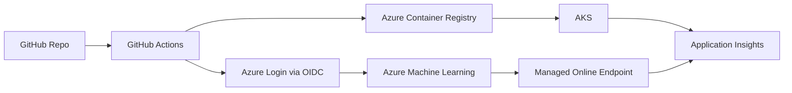

# MLOps Azure Lab Wiki

Bienvenue dans le wiki du repo.

Ce wiki explique comment lire ce projet comme une implementation MLOps cloud sur Azure,
avec GitHub Actions pour la CI/CD et des parallels explicites avec Azure DevOps.

## Positionnement

Ce contenu est pense comme un support de formation technique pour :

- des data scientists qui veulent comprendre ce qui se passe apres le notebook
- des ML engineers juniors qui veulent relier code, CI/CD, cloud et deploiement
- des profils techniques qui connaissent deja Python et le machine learning, mais pas encore toute la chaine MLOps

## Comment lire cette wiki

Il faut lire ce wiki comme un support de comprehension.

- les pages du wiki expliquent les concepts, les choix d'architecture et les bonnes pratiques
- les labs donnent les instructions pas-a-pas pour manipuler le repo et Azure
- le README reste la porte d'entree du projet

Autrement dit:

- `lab/` repond surtout a la question "que faut-il faire maintenant ?"
- `docs/wiki/` repond surtout a la question "qu'est-ce que cela veut dire, pourquoi on le fait et comment raisonner proprement ?"

## Parcours recommande

1. [Workflow global d'un projet MLOps sur Azure](./00-workflow-global-azure-mlops.md)
2. [Vision MLOps Cloud sur Azure](./01-vision-mlops-cloud.md)
3. [Architecture du repo](./02-architecture-du-repo.md)
4. [CI/CD GitHub Actions + Azure](./03-ci-cd-github-actions-azure.md)
5. [Serving, observabilite et gouvernance](./04-serving-observabilite-gouvernance.md)
6. [GitHub Actions vs Azure DevOps](./05-github-actions-vs-azure-devops.md)
7. [Glossaire MLOps Azure](./06-glossaire-mlops-azure.md)

## Ce que montre le repo

- un projet ML transforme en scripts versionnes, testables et deployables
- une infrastructure Azure deployee en IaC
- une CI/CD qui relie GitHub, Azure ML, ACR et AKS
- deux chemins de serving complementaires: AKS et AML Managed Endpoint
- une approche securisee via OIDC et RBAC
- des environnements `dev` et `prod` avec promotion controlee
- une observabilite verifiable via Application Insights et requetes KQL

## Ce que ce projet n'essaie pas de faire

Ce depot n'essaie pas d'etre:

- une plateforme entreprise complete
- une reference absolue de production pour tous les contextes
- un cours exhaustif sur Azure

Le choix pedagogique est volontaire:

- montrer une chaine MLOps complete mais de taille raisonnable
- rendre visibles les interactions entre les briques
- garder assez de realisme pour parler de bonnes pratiques, de cout, de RBAC et d'observabilite

## Vue d'ensemble

## Points cles a retenir

- le MLOps ne concerne pas seulement l'entrainement du modele
- le cloud sert ici a standardiser l'execution, le deploiement et l'observabilite
- GitHub Actions et Azure DevOps repondent a des besoins tres proches avec des differences surtout d'ecosysteme et de gouvernance
- le but du wiki est de rendre ces notions lisibles sans demander un niveau expert en infra

## Questions auxquelles ce wiki repond

Si tu debutes, voici les questions auxquelles tu devrais trouver une reponse en lisant la wiki:

- pourquoi sortir d'un notebook pour aller vers des scripts et des workflows
- a quoi servent Azure ML, ACR, AKS et Application Insights dans la meme chaine
- pourquoi on separe `dev` et `prod`
- pourquoi on parle de CI/CD, OIDC, RBAC et IaC dans un projet ML
- pourquoi "un modele qui marche" ne suffit pas pour parler de production

## Erreurs de lecture frequentes

Quand on debute, on a souvent tendance a croire que:

- "MLOps" veut juste dire "deployer un modele"
- Azure ML suffit a lui seul a resoudre tout le sujet
- Kubernetes est obligatoire pour tous les cas
- l'observabilite se limite a regarder si le endpoint repond
- la securite peut etre ajoutee a la fin

Le repo montre justement l'inverse:

- le MLOps est une chaine
- chaque brique couvre seulement une partie du probleme
- il faut relier code, infra, identite, deployment et monitoring

## Comment utiliser ce wiki en formation

- commencer par le workflow global pour comprendre la chaine de bout en bout
- utiliser ensuite la vision globale pour fixer le vocabulaire MLOps
- passer ensuite a l'architecture du repo pour voir ou vivent les differentes briques
- lire la page CI/CD comme une explication pas-a-pas de ce que fait l'automatisation
- garder la comparaison GitHub / Azure DevOps pour la fin, comme repere et non comme prerequis
- utiliser le glossaire des qu'un terme cloud devient flou

## Liens utiles

- [README du projet](../../README.md)
- [Setup du lab](../../lab/lab0-setup.md)
- [Jour 3 CI/CD](../../lab/jour3.md)
- [Jour 4 Monitoring](../../lab/jour4.md)
- [Jour 5 Securite et gouvernance](../../lab/jour5.md)

## Navigation

- Suite: [Workflow global d'un projet MLOps sur Azure](./00-workflow-global-azure-mlops.md)
