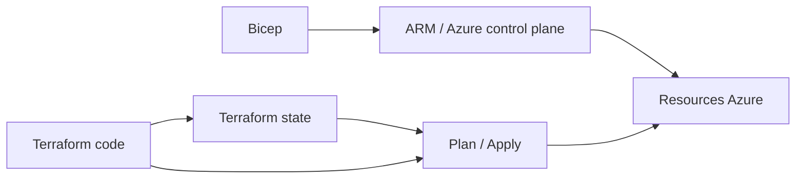

# Jour 2 — Infrastructure as Code & Environnements

## Objectifs
- Demarrer avec Bicep pour comprendre l'IaC Azure-native
- Basculer sur Terraform pour la gestion operationnelle de dev/prod
- Comprendre la separation dev/prod
- Comparer Bicep vs Terraform sur une meme architecture

## Pourquoi ce jour existe

Jusqu'ici, on a surtout manipule Azure "a la main" ou via quelques scripts.
Le but du Jour 2 est de passer a une logique **Infrastructure as Code (IaC)**:
- l'infrastructure est decrite dans des fichiers
- ces fichiers peuvent etre relus, versionnes et revus dans Git
- on peut recreer un environnement de maniere plus fiable
- on reduit les ecarts entre ce qui est documente et ce qui existe vraiment dans Azure

En pratique, on va creer la meme famille de ressources avec deux approches:
- **Bicep** pour comprendre la logique Azure-native
- **Terraform** pour la gestion operationnelle de la suite du lab

## Bicep vs Terraform en clair

### Bicep

Bicep est le langage IaC natif de l'ecosysteme Azure.
On decrit des ressources Azure, puis Azure Resource Manager se charge du deploiement.

Schema mental:
```text
fichier .bicep
    -> compilation ARM
    -> Azure Resource Manager
    -> creation des ressources Azure
```

Ce que Bicep fait bien dans ce lab:
- montrer comment Azure pense ses ressources et leurs dependances
- decrire une infra Azure de maniere lisible
- rester tres proche des concepts natifs Azure

### Terraform

Terraform est un outil IaC multi-cloud et multi-providers.
Il conserve un **state** qui represente l'infrastructure qu'il pense gerer, puis compare:
- ce qui est decrit dans le code
- ce qui est deja dans le state
- ce qu'il faut creer, modifier ou detruire

Schema mental:
```text
fichiers .tf + .tfvars
    + terraform state
    -> terraform plan
    -> terraform apply
    -> ressources Azure
```

Ce que Terraform fait bien dans ce lab:
- separer clairement `dev` et `prod`
- garder un state distant partageable
- rendre les changements plus explicites via `plan`
- s'integrer facilement dans une logique d'exploitation et de CI/CD

### Comparaison simple



En resume:
- **Bicep** = excellent pour comprendre et decrire Azure de facon native
- **Terraform** = plus adapte ici pour gerer des environnements durables et repetables

## Ce qu'on va conserver pour la suite

Pour la suite du lab, on **conserve Terraform comme source principale d'infrastructure**.

Pourquoi:
- on veut gerer `dev` et `prod` avec la meme structure
- on veut un `terraform plan` lisible avant les changements
- on veut un backend distant pour garder un state propre
- on veut un outillage courant en contexte plateforme / exploitation

Ce qu'on garde exactement:
- le dossier `infrastructure/terraform/`
- les fichiers `environments/dev.tfvars` et `environments/prod.tfvars`
- le backend distant `tfstate`

Ce qu'on ne garde pas comme chemin principal:
- la demo Bicep du debut de J2

Pourquoi:
- elle sert surtout a comprendre le modele Azure-native
- elle est utile pedagogiquement, mais ce n'est pas le socle retenu pour J3/J4/J5

Vue d'ensemble:
```text
J2:
  Bicep -> comprendre l'approche Azure-native
  Terraform -> mettre en place l'infra retenue

J3/J4/J5:
  Terraform -> faire evoluer et relire l'infra des environnements
  AML / CI-CD / deploiement -> s'appuyer sur cette infra
```

## Atelier

### 1. Demo Bicep rapide (15 min)
```bash
az login
bash scripts/deploy-bicep-demo.sh rg-mlopslab-bicep-demo westeurope
```
Objectif: voir le flux Bicep en mode **lite** (cout + temps reduits) sans impacter les environnements Terraform.

Ce que cette demo montre:
- un deploiement declaratif Azure-native
- la notion de ressources + dependances
- un cycle rapide pour comprendre la mecanique IaC sans installer toute la structure Terraform

Option avancee (full Bicep avec garde-fous):
```bash
# Garde-fous integres: project_name unique obligatoire + RG reservees bloquees
bash scripts/deploy-bicep-full.sh dev mlopsteam01 rg-mlopsteam01-dev westeurope
```

### 2. Preparer le backend Terraform (10 min)
```bash
TFSTATE_SUFFIX=$(whoami | tr -cd 'a-z0-9' | cut -c1-8)
TFSTATE_SA="satfstate${TFSTATE_SUFFIX}"

az group create --name rg-tfstate --location westeurope
az storage account create --name "$TFSTATE_SA" --resource-group rg-tfstate --sku Standard_LRS
az storage container create --name tfstate --account-name "$TFSTATE_SA"
```

Ce que cette etape fait:
- cree un compte de stockage Azure
- cree un conteneur `tfstate`
- permet a Terraform de stocker son state a distance plutot qu'en local

Pourquoi c'est important:
- eviter les states locaux perdus ou divergents
- faciliter le travail en equipe
- preparer un fonctionnement proche d'un vrai projet

### 3. Terraform dev (25 min)
```bash
cd infrastructure/terraform
terraform init \
  -backend-config="resource_group_name=rg-tfstate" \
  -backend-config="storage_account_name=$TFSTATE_SA" \
  -backend-config="container_name=tfstate" \
  -backend-config="key=mlopslab-dev.tfstate"

terraform plan -var-file="environments/dev.tfvars"
terraform apply -var-file="environments/dev.tfvars"
```

Ce que cette etape fait:
- `init` prepare le provider Azure et connecte le backend distant
- `plan` montre ce que Terraform va creer
- `apply` cree les ressources du lab pour `dev`

Ressources principales creees:
- Resource Group
- Storage Account
- Key Vault
- ACR
- Log Analytics + Application Insights
- AML Workspace
- AKS

Recommandation lab:
- Faire **au minimum** l'environnement `dev`
- Prevoir un `terraform destroy -var-file="environments/dev.tfvars"` en fin de session si le cluster ne sert plus
- Ne pas laisser AKS tourner inutilement pendant la nuit ou plusieurs jours

Point cout:
- `dev` cree un cluster AKS avec `1 x Standard_D2s_v3`
- C'est acceptable pour un lab court, mais ce n'est pas une infra "gratuite"

### 4. Terraform prod (optionnel, 10 min)
> **Important — optionnel pour raison de cout**
>
> Cette etape est **optionnelle**. Elle existe pour illustrer la separation `dev` / `prod`,
> mais elle cree une infra sensiblement plus chere que `dev`.
>
> La configuration actuelle `prod` cree un cluster AKS avec `2 x Standard_D4s_v3`.
> Pour un lab, **ne lancer cette etape que si c'est explicitement demande**.
> Sinon, rester sur `dev` suffit pour valider les objectifs du Jour 2.

```bash
terraform init -reconfigure \
  -backend-config="resource_group_name=rg-tfstate" \
  -backend-config="storage_account_name=$TFSTATE_SA" \
  -backend-config="container_name=tfstate" \
  -backend-config="key=mlopslab-prod.tfstate"

terraform plan -var-file="environments/prod.tfvars"
terraform apply -var-file="environments/prod.tfvars"
```

Ce que cette etape montre pedagogiquement:
- la meme base d'infrastructure
- mais avec un fichier de variables different
- donc un environnement separe avec son propre state

Si tu lances quand meme `prod` pour la demo:
- verifier le `terraform plan` avant `apply`
- detruire l'environnement a la fin avec `terraform destroy -var-file="environments/prod.tfvars"`
- ne pas considerer cette configuration comme une vraie prod

Si tu veux une "prod low cost" uniquement pour tester la commande:
- dupliquer `environments/prod.tfvars` dans un fichier temporaire, par exemple `environments/prod-lowcost.tfvars`
- reduire temporairement la taille a `aks_node_count = 1` et `aks_vm_size = "Standard_D2s_v3"`
- lancer `plan/apply` avec ce fichier temporaire
- detruire juste apres le test

Exemple:
```bash
cp environments/prod.tfvars environments/prod-lowcost.tfvars
# puis editer prod-lowcost.tfvars:
# aks_node_count = 1
# aks_vm_size    = "Standard_D2s_v3"

terraform plan -var-file="environments/prod-lowcost.tfvars"
terraform apply -var-file="environments/prod-lowcost.tfvars"
terraform destroy -var-file="environments/prod-lowcost.tfvars"
```

Pour une vraie production:
- dimensionner AKS selon la charge reelle, pas "au plus petit"
- utiliser au minimum plusieurs nœuds et une capacite compatible avec la haute disponibilite
- definir des exigences claires sur disponibilite, supervision, sauvegarde, reseau et securite
- revoir le SKU ACR, les logs, les policies et le dimensionnement avant toute mise en service

### 5. Verification + comparaison (10 min)
- `terraform output` pour verifier AML/AKS/ACR
- Portail Azure: verifier rg-mlopslab-dev (7 ressources)
- Ouvrir `infrastructure/terraform-reference/` pour voir une version simplifiee de lecture

Questions a savoir expliquer a la fin:
- Que fait Bicep dans Azure, sans notion de state Terraform ?
- A quoi sert le backend `tfstate` ?
- Pourquoi `dev` et `prod` ont des fichiers de variables differents ?
- Pourquoi la suite du lab s'appuie sur Terraform plutot que sur la demo Bicep ?

## Checkpoint J2
- [ ] 7 ressources dans rg-mlopslab-dev
- [ ] Terraform state distant configure
- [ ] Outputs Terraform visibles (workspace + AKS + ACR)
- [ ] Differences Bicep vs Terraform expliquees
