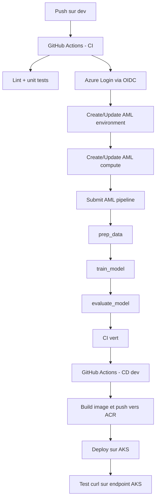
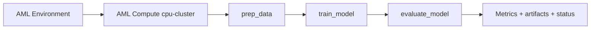
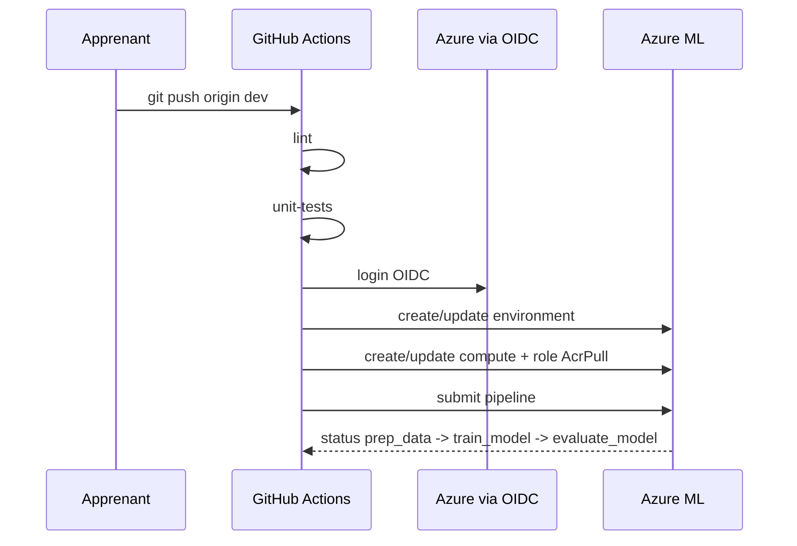

# Jour 3 — CI/CD pour le Machine Learning

## Objectifs
- Comprendre Azure Pipelines et GitHub Actions (theorie)
- Lire et comprendre les 3 workflows CI/CD principaux du repo
- Relier ce qui a ete teste en notebook J1 avec son execution automatisee en CI
- Declencher un CI reel (commit -> AML pipeline)
- Observer le deploiement AKS end-to-end

## Matin — Theorie : Azure Pipelines vs GitHub Actions (40 min)

### Meme concept, deux syntaxes

Les deux systemes font la meme chose : detecter un evenement (push, tag, timer),
executer des steps dans un runner (VM temporaire), interagir avec Azure.
La difference est dans l'ecosysteme et la syntaxe YAML.

```yaml
# Azure Pipelines (azure-pipelines.yml)    # GitHub Actions (.github/workflows/ci.yml)
trigger:                                    on:
  branches:                                   push:
    include: [main]                             branches: [main]

pool:                                       jobs:
  vmImage: ubuntu-latest                      train:
                                               runs-on: ubuntu-latest
steps:
- task: AzureCLI@2                             steps:
  inputs:                                      - uses: actions/checkout@v4
    azureSubscription: 'my-conn'               - uses: azure/login@v2
    scriptType: bash                             with:
    inlineScript: |                                client-id: ${{ secrets.AZURE_CLIENT_ID }}
      az ml job create \                       - run: az ml job create \
        --file pipeline.yml                          --file mlops/pipelines/pipeline.yml
```

### Differences cles

| | Azure Pipelines | GitHub Actions |
|---|---|---|
| Hebergement | dev.azure.com (portail separe) | github.com (meme repo) |
| Auth Azure | Service Connection (UI) | OIDC (Federated Credentials) |
| Reutilisabilite | Templates YAML | Reusable Workflows |
| Ecosysteme | Azure-first | Open source / multi-cloud |
| Visibilite YAML | Dans le repo | Dans le repo |
| Courbe d'apprentissage | Legerement plus verbeux | Plus concis |

### Quand voir ADO en entreprise ?
- Grandes entreprises avec licences Microsoft existantes
- Projets qui utilisent deja Azure Repos (git integre a ADO)
- Equipes qui veulent tout dans un seul portail Azure

**Pour ce lab : GitHub Actions.** Le YAML est dans le repo, les stagiaires le voient
et le modifient directement sans naviguer vers un portail supplementaire.

---

## Apres-midi — Atelier : GitHub Actions en pratique

## Ce qui se passe derriere les workflows

Le point important du Jour 3 est que le `git push` ne lance pas "juste des tests Python".
Il declenche une chaine complete entre GitHub, Azure ML, ACR et AKS.

Vue d'ensemble:


Pourquoi cela peut prendre du temps:
- GitHub doit d'abord demarrer un runner
- Azure Login via OIDC doit obtenir un token
- AML doit preparer ou mettre a jour l'environnement d'execution
- le compute `cpu-cluster` peut devoir sortir de veille si `min-instances = 0`
- AML doit tirer l'image Docker depuis l'ACR
- le pipeline AML enchaine ensuite `prep_data`, `train_model`, `evaluate_model`
- seulement apres un CI vert, le workflow CD construit l'image applicative et la deploie sur AKS

En pratique, le script Python `prep.py` est tres rapide.
Si l'etape `prep_data` semble longue, le temps est souvent consomme par:
- le reveil du compute AML
- la preparation du conteneur
- le pull de l'image
- les operations d'infrastructure AML avant l'execution du code

Schema du pipeline AML:


Ce qu'il faut observer dans AML Studio:
- `Queued` ou `Preparing` = AML prepare l'infra, pas encore ton code
- `Running` sur `prep_data` = le conteneur du step est lance
- `Completed` = le step est termine
- `Failed` = regarder les logs du child job concerne

Regle pratique:
- premier run apres creation du compute: plus lent
- runs suivants: souvent plus rapides grace au cache AML
- ce qui parait "lent" n'est pas forcement un bug, surtout au premier passage

Positionnement du script `bootstrap-aml.sh`:
- il sert a preparer les assets AML apres creation de l'infrastructure
- le meilleur moment pour le lancer manuellement est en fin de Jour 2
- au Jour 3, avec le repo a jour, le workflow CI sait normalement faire ce qu'il faut sans bootstrap manuel
- si un environnement a ete cree avant les derniers correctifs, relancer `bootstrap-aml.sh` reste un bon outil de rattrapage

### 1. Lire les workflows (15 min)
Ouvrir `.github/workflows/` et repondre :
- Qu'est-ce qui declenche `ci-train.yml` ?
- Pourquoi `train-pipeline` a `environment: dev` ?
- Que font les 3 commandes `sed` dans `cd-deploy-dev.yml` ?
- Pourquoi `cd-deploy-prod.yml` necessite `environment: production` ?
- Quelles etapes du notebook J1 sont reprises dans les scripts `prep.py`, `train.py`, `evaluate.py` ?

### 2. Premier push sur dev (10 min)
Avant le push, verifier que l'identite GitHub OIDC a bien les droits sur le workspace cree au Jour 2.
Sans cela, le job `train-pipeline` echoue typiquement sur `az ml environment create`.

Checks conseilles:
```bash
PRINCIPAL_ID=$(az ad sp list --display-name "github-mlops-lab" --query "[0].id" -o tsv)

az role assignment list \
  --assignee "$PRINCIPAL_ID" \
  --all \
  --query "[].{role:roleDefinitionName,scope:scope}" \
  -o table
```

Verifier au minimum:
- `Contributor` sur `rg-mlopslab-dev`
- `User Access Administrator` sur `rg-mlopslab-dev`

Si les roles viennent d'etre ajoutes:
- attendre 2 a 5 minutes
- relancer ensuite le workflow

Puis faire le push:
```bash
git checkout dev
# Modifier train.py : max_iter 200 -> 300
git add mlops/data-science/src/train.py
git commit -m "feat: max_iter 300"
git push origin dev
```
Observer GitHub Actions : les 3 jobs de `ci-train.yml`.

Si tu veux relancer la CI avec le **dernier contenu du repo**:
- eviter de seulement cliquer sur `Re-run jobs` d'un ancien workflow si des fichiers ont change depuis
- un rerun relance le workflow sur le meme commit SHA
- pour forcer un nouveau run sur l'etat courant de `dev`, tu peux pousser un commit vide

Exemple:
```bash
git commit --allow-empty -m "chore: rerun ci"
git push origin dev
```

Ce que fait concretement ce push:


### 3. Observer le pipeline AML (15 min)
Azure ML Studio > Jobs > pipeline en cours.
Cliquer sur chaque etape : prep_data, train_model, evaluate_model.

Pourquoi `prep_data` peut sembler "bloque":
- le code de preparation est simple et rapide
- mais AML doit parfois d'abord allouer le compute, preparer l'environnement et tirer l'image
- c'est donc souvent une attente d'infrastructure, pas une attente "metier"

Si le job echoue sur `az ml environment create` avec `AuthorizationFailed`:
- verifier a nouveau les rôles Azure RBAC de l'app `github-mlops-lab`
- confirmer que `rg-mlopslab-dev` a bien ete cree par Terraform puis que les rôles ont ete reappliques dessus
- relancer le workflow apres propagation IAM

### 4. Tester l'endpoint AKS (15 min)
```bash
az aks get-credentials --resource-group rg-mlopslab-dev --name aks-mlopslab-dev
kubectl get svc iris-classifier-svc   # noter EXTERNAL-IP
curl -X POST http://EXTERNAL_IP/score \
  -H "Content-Type: application/json" \
  -d '{"data": [[5.1, 3.5, 1.4, 0.2]]}'
# Attendu : [{"prediction": "setosa", ...}]
```

Cette etape ne teste pas AML directement.
Elle teste le resultat du workflow CD dev:
- build de l'image applicative
- push dans l'ACR
- deploiement Kubernetes sur AKS
- exposition du service `iris-classifier-svc`

### 5. Deployer le Managed Endpoint AML (backup fonctionnel, 10 min)
Dans GitHub Actions, lancer le workflow manuel:
- `CD — Deploy AML Managed Endpoint`
- `target_env=dev`

Puis verifier l'invocation smoke-test dans les logs du workflow.

### 6. Tester le quality gate (5 min)
```bash
# Dans evaluate.py, passer min_accuracy a 0.99
# Pousser -> observer le CI echouer sur evaluate_model
# Remettre 0.90 et repousser
```

## Checkpoint J3
- [ ] CI vert (lint + tests + AML pipeline)
- [ ] Endpoint AKS repond a curl
- [ ] Managed Endpoint AML deploye et invoque avec succes
- [ ] Quality gate teste : echec a 0.99, succes a 0.90
