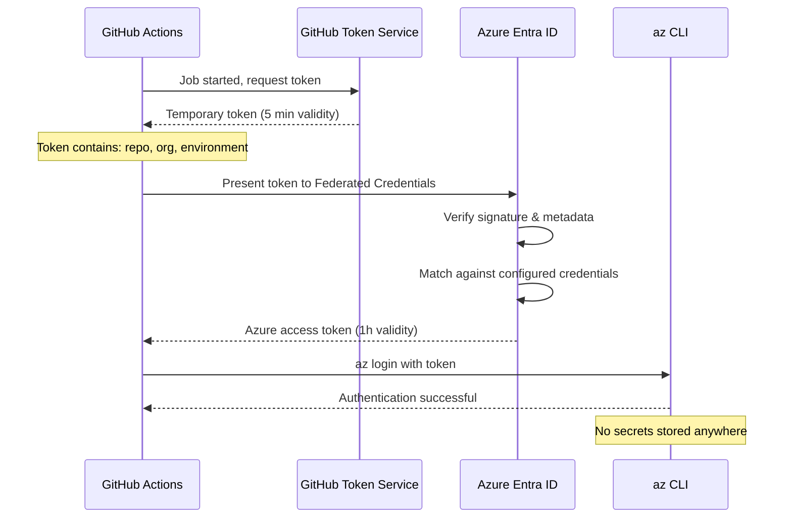

# Lab 0 — Setup de l'environnement (à faire AVANT le Jour 1)

Ce lab 0 prend environ 45 minutes. À faire seul avant la première session.
Si tu bloques sur une étape, note l'erreur exacte et apporte-la en J1.

## Ce que tu vas configurer
1. Accès Azure + outils locaux
2. App Registration Azure (l'identité de ton pipeline)
3. OIDC / Federated Credentials (auth sans mot de passe entre GitHub et Azure)
4. GitHub Secrets et Environments
5. Vérification finale


## Étape 1 — Vérifier ton accès Azure et installer les outils

```bash
# Connexion Azure
az login
# Lister tes subscriptions et noter le bon ID
az account list --output table
az account set --subscription "NOM_OU_ID_DU_SUBSCRIPTION"
# Vérifier
az account show --query "{name:name, id:id, state:state}"
# → state doit être "Enabled"

# Installer l'extension AML CLI v2
az extension add -n ml --yes
az ml --version    # doit afficher une version

# Installer uv (gestionnaire Python rapide)
# Voir: https://docs.astral.sh/uv/getting-started/installation/
uv --version

# Cloner le repo
git clone https://github.com/TON_ORG/mlops-azure-lab.git
cd mlops-azure-lab
uv venv --python 3.10
source .venv/bin/activate
uv pip install -r requirements.txt
```


## Étape 2 — Créer l'App Registration Azure

> **C'est quoi ?** Une App Registration est une identité dans Microsoft Entra ID (anciennement
> Azure Active Directory). Elle représente ton pipeline GitHub Actions auprès d'Azure.
> Au lieu de stocker un mot de passe quelque part, tu crées cette identité et tu lui donnes
> des permissions sur Azure. Le mot de passe n'existe jamais — c'est le principe d'OIDC.

### 2a. Créer l'App Registration

1. Aller sur https://portal.azure.com
2. Barre de recherche en haut → taper **"Microsoft Entra ID"** → cliquer le résultat
3. Menu gauche → **Manage** → **App registrations** → bouton **New registration**
4. Remplir :
   - **Name** : `github-mlops-lab`
   - **Supported account types** : *Accounts in this organizational directory only*
   - **Redirect URI** : laisser vide
5. Cliquer **Register**

### 2b. Noter les 3 identifiants importants

Sur la page qui s'affiche après création, noter :

| Champ | Où le trouver | Variable GitHub Secret |
|-------|---------------|------------------------|
| Application (client) ID | En haut de la page | `AZURE_CLIENT_ID` |
| Directory (tenant) ID | En haut de la page | `AZURE_TENANT_ID` |
| Subscription ID | Via CLI (voir commande ci-dessous) | `AZURE_SUBSCRIPTION_ID` |

```bash
az account show --query id -o tsv
# → copier cette valeur, c'est ton AZURE_SUBSCRIPTION_ID
```

### 2c. Donner les permissions Azure à cette identité (least privilege)

 > Objectif : éviter `Contributor` au scope subscription.
 > On donne des droits au **niveau Resource Group** uniquement.

  1. Definir un suffixe unique dans `lab/env/naming.env` pour éviter les collisions si plusieurs personnes partagent la meme subscription.

 ```bash
 export LAB_SUFFIX="seb"
 ```

  2. Créer **uniquement** le Resource Group du backend Terraform :
 
 ```bash
 source lab/env/partie2.env
 az group create --name "$TFSTATE_RG" --location "$TFSTATE_LOCATION"
 ```
 
 3. Les attributions de rôles Azure pour `github-mlops-lab` seront faites dans la partie 2, une fois les resource groups du lab créés.

## Étape 3 — Configurer OIDC (Federated Credentials)

> **Pourquoi OIDC et pas un secret ?**
>
> Sans OIDC, il faudrait créer un secret (mot de passe) sur l'App Registration et le stocker.
>
> dans GitHub. Problème : ce secret est valable longtemps, peut fuiter dans les logs, et doit être renouvelé manuellement.

Avec OIDC (Workload Identity Federation), le flux est :



C'est le standard industrie depuis 2022. Zéro secret, zéro rotation manuelle.

### 3a. Accéder aux Federated Credentials

Dans l'App Registration `github-mlops-lab` :
Menu gauche → **Certificates & secrets** → onglet **Federated credentials** → **Add credential**

### 3b. Créer les 3 credentials (un par un)

**Credential 1 — CI sur branche main :**

| Champ | Valeur |
|-------|--------|
| Federated credential scenario | *GitHub Actions deploying Azure resources* |
| Organization | `TON_USERNAME_OU_ORG_GITHUB` |
| Repository | `mlops-azure-lab` |
| Entity type | **Branch** |
| Based on selection | `main` |
| Name | `github-branch-main` |

→ Cliquer **Add**

**Credential 2 — CD environment dev :**

| Champ | Valeur |
|-------|--------|
| Federated credential scenario | *GitHub Actions deploying Azure resources* |
| Organization | `TON_USERNAME_OU_ORG_GITHUB` |
| Repository | `mlops-azure-lab` |
| Entity type | **Environment** |
| Based on selection | `dev` |
| Name | `github-env-dev` |

→ Cliquer **Add**

**Credential 3 — CD environment production :**

| Champ | Valeur |
|-------|--------|
| Federated credential scenario | *GitHub Actions deploying Azure resources* |
| Organization | `TON_USERNAME_OU_ORG_GITHUB` |
| Repository | `mlops-azure-lab` |
| Entity type | **Environment** |
| Based on selection | `production` |
| Name | `github-env-production` |

→ Cliquer **Add**

Tu dois avoir **3 Federated Credentials** listés dans l'onglet.

> **Pourquoi 3 et pas 1 ?** Azure vérifie le token OIDC avec précision.
> Un token émis pour `branch=main` ne peut pas être utilisé pour `environment=production`.
> Chaque credential autorise un contexte précis — c'est le principe du moindre privilège.


## Étape 4 — Configurer les GitHub Secrets et Environments

### 4a. Ajouter les 9 Repository Secrets

 Dans ton repo GitHub → **Settings** → **Secrets and variables** → **Actions** → **New repository secret**
 
 Ajouter ces secrets un par un :

 ```bash
 source lab/env/naming.env
 ```

 | Secret Name | Valeur |
 |-------------|--------|
 | `AZURE_CLIENT_ID` | Application (client) ID (étape 2b) |
 | `AZURE_TENANT_ID` | Directory (tenant) ID (étape 2b) |
 | `AZURE_SUBSCRIPTION_ID` | Subscription ID (étape 2b) |
| `AML_WORKSPACE_DEV` | `$AML_WORKSPACE_DEV` |
| `AML_WORKSPACE_PROD` | `$AML_WORKSPACE_PROD` |
| `AML_RESOURCE_GROUP_DEV` | `$AML_RESOURCE_GROUP_DEV` |
| `AML_RESOURCE_GROUP_PROD` | `$AML_RESOURCE_GROUP_PROD` |
| `AKS_CLUSTER_DEV` | `$AKS_CLUSTER_DEV` |
| `AKS_CLUSTER_PROD` | `$AKS_CLUSTER_PROD` |

> Les 6 derniers contiennent les noms des ressources Azure qui seront créées en J2.
> Tu les rentres maintenant pour ne pas avoir à y revenir.

> Si tu utilises un suffixe, ces valeurs doivent rester coherentes avec `lab/env/naming.env`.

### 4b. Créer les 2 GitHub Environments

Dans ton repo GitHub → **Settings** → **Environments** → **New environment**

**Environment 1 :**
- Name : `dev`
- Pas de protection → cliquer **Configure environment** sans rien modifier

**Environment 2 :**
- Name : `production`
- Cocher **Required reviewers** → ajouter ton GitHub username
- Cliquer **Save protection rules**

> Le workflow `cd-deploy-prod.yml` utilise `environment: production`. GitHub bloquera
> l'exécution jusqu'à ce qu'un reviewer approuve. C'est le quality gate prod.


## Étape 5 — Vérification finale

```bash
# Test 1 : Azure CLI connecté
az account show --query "{name:name, state:state}" -o table
# → state = Enabled

# Test 2 : App Registration visible
az ad app list --display-name "github-mlops-lab" --query "[].{name:displayName, id:appId}" -o table
# → 1 ligne affichée

# Test 3 : GitHub Secrets (vérification visuelle seulement)
# GitHub > Settings > Secrets > vérifier que les 9 secrets apparaissent dans la liste
# Les valeurs ne sont jamais affichées — c'est normal
```

Si tous les tests passent → prêt pour commencer !!

---

## Tableau de dépannage

| Symptôme | Cause probable | Solution |
|----------|----------------|----------|
| `az login` échoue / pas de subscription | Compte sans accès | Contacter le formateur |
| App Registration créée mais rôle refusé | Propagation IAM lente | Attendre 2-3 min, réessayer |
| GitHub Actions : `AADSTS70021: No matching federated identity record found` | Federated Credential mal configuré (mauvais repo, org, ou entity type) | Vérifier les 3 credentials : org/repo exact, entity type exact |
| GitHub Actions : `ClientSecretCredentialAuthenticationError` | AZURE_CLIENT_ID ou AZURE_TENANT_ID incorrect | Revérifier les secrets GitHub vs l'App Registration |
| GitHub Actions : `AuthorizationFailed` sur `roleAssignments` | Rôle `User Access Administrator` manquant | Ajouter `User Access Administrator` sur `$AML_RESOURCE_GROUP_DEV` et `$AML_RESOURCE_GROUP_PROD` (voir `lab/env/naming.env`) |
| `pytest` : `ModuleNotFoundError` | dépendances non installées | `uv pip install -r requirements.txt` |
