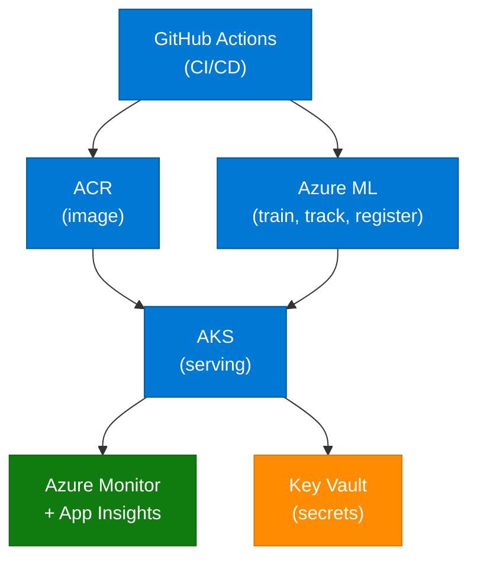

# Partie 1 — Fondations : du notebook aux scripts

## Objectifs
- Comprendre la différence entre DevOps et MLOps
- Naviguer dans les services Azure clés (AML, ACR, AKS)
- Démarrer par un notebook pour visualiser le flux dans l'interface AML
- Lancer le pipeline ML localement de bout en bout

## Positionnement de la Partie 1 par rapport à la Partie 2

La Partie 1 est une phase de **prise en main** :
- vous découvrez les concepts
- vous exécutez le pipeline ML en local
- vous comprenez comment AML sera utilisé par la suite

## Prérequis
- Compte Azure actif avec accès au subscription du lab
- `git`, Python 3.10, Azure CLI installés localement
- **Partie 0 (setup) terminée** : l'infrastructure Terraform doit être déployée

## Architecture cible

Voici l'architecture que vous allez construire au fil des parties :



## Atelier

### 1. Setup local (5 min)

Clonez le dépôt et préparez l'environnement Python avec `uv` (gestionnaire rapide et reproductible) :

```bash
git clone https://github.com/TON_ORG/mlops-azure-lab.git
cd mlops-azure-lab
uv venv --python 3.10
source .venv/bin/activate
uv pip install -r requirements.txt
```

> [!INFO]
> `uv venv` crée un environnement virtuel isolé dans `.venv/`. `uv pip install` installe les dépendances beaucoup plus rapidement que `pip` classique.

### 2. Convention de branches (5 min)

Le dépôt suit une stratégie **trunk-based** simplifiée :

| Branche | Rôle | Pipeline déclenché |
|---|---|---|
| `main` | Code de production | CI + CD prod (avec approbation manuelle) |
| `dev` | Intégration continue | CI + CD dev (automatique) |
| `feature/*` | Développement d'une fonctionnalité | CI seulement |

### 3. Vérifier l'accès Azure (10 min)

Avant de lancer quoi que ce soit sur Azure, vérifiez que votre CLI est authentifiée sur le bon tenant et la bonne souscription :

```bash
az login
az account show --query "{sub:id, name:name, tenant:tenantId, user:user.name}" -o json
```

Ce qu'il faut observer :
- `sub` correspond bien à la souscription du lab
- `user` est votre compte Entra ID attendu
- le workspace AML `dev` sera la cible principale pour la suite du lab

### 4. Notebook first (15 min)

Ouvrez et lisez le notebook `mlops/data-science/notebooks/iris-walkthrough.ipynb` pour comprendre la logique `prep -> train -> evaluate`. Vous pouvez également exécuter les cellules en local si vous le souhaitez.

Si le workspace AML `dev` n'existe pas encore à ce stade :
- lisez le notebook en local (sans le lancer dans AML)
- concentrez-vous sur la logique `prep -> train -> evaluate`
- la partie AML opérationnelle sera reprise en Partie 2, après création de l'infrastructure

Points à observer :
- le split train/test créé par `prep`
- le modèle `model.joblib` sauvegardé par `train`
- la **quality gate** (seuil de précision minimum) dans `evaluate`

### 5. Passage notebook → scripts (15 min)

Le notebook est pédagogique mais pas reproductible en CI/CD. Les scripts `prep.py`, `train.py`, `evaluate.py` contiennent la même logique sous forme exécutable. Lancez-les en local pour valider l'ensemble du pipeline :

```bash
# Étape 1 : préparer les données (split train/test)
uv run python mlops/data-science/src/prep.py --output_dir /tmp/iris

# Étape 2 : entraîner le modèle
uv run python mlops/data-science/src/train.py --data_dir /tmp/iris --model_dir /tmp/model

# Étape 3 : évaluer avec la quality gate
uv run python mlops/data-science/src/evaluate.py --data_dir /tmp/iris --model_dir /tmp/model

# Étape 4 : exécuter les tests unitaires
uv run pytest tests/ -v
```

> [!NOTE]
> Ces trois scripts seront ré-exécutés exactement de la même manière par le pipeline AML en Partie 2, ce qui garantit la **parité local / cloud**.

## Checkpoint Partie 1
- [ ] Notebook Iris exécuté de bout en bout
- [ ] Pipeline local (`prep` → `train` → `evaluate`) sans erreur
- [ ] `uv run pytest tests/ -v` : 5 tests PASSED

