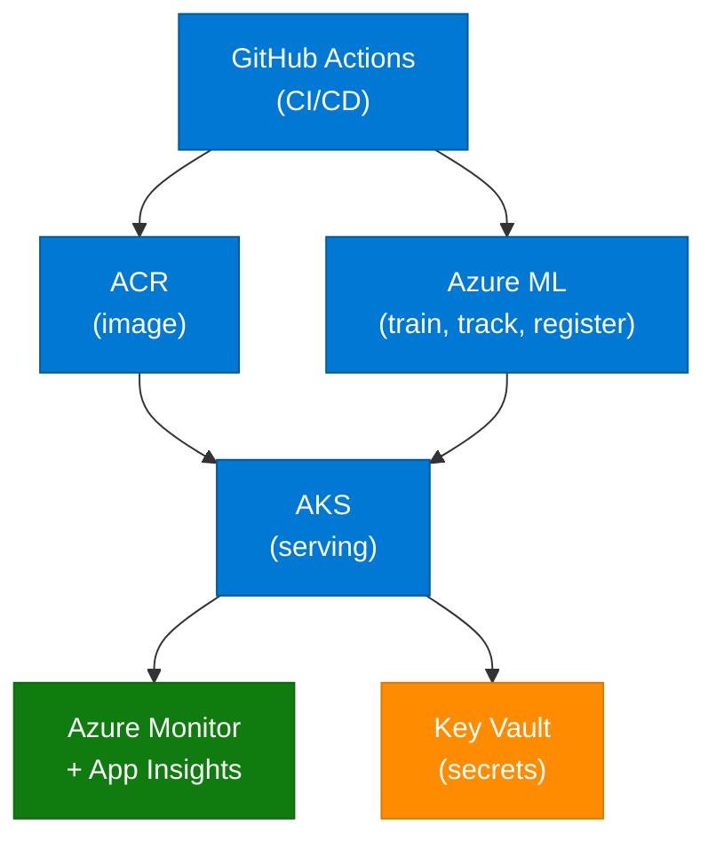

# Partie 1 — Fondations : du notebook aux scripts

## Objectifs
- Comprendre DevOps vs MLOps
- Naviguer dans les services Azure cles (AML, ACR, AKS)
- Demarrer par un notebook pour visualiser le flux dans l'interface AML
- Lancer le pipeline ML localement de bout en bout

## Positionnement de J1 par rapport a J2
Le Jour 1 est une journee de **prise en main**:
- on decouvre les concepts
- on execute le pipeline ML en local
- on comprend comment AML va etre utilise ensuite

## Prerequis
- Compte Azure actif avec acces au subscription de lab
- git, Python 3.10, Azure CLI installes
- partie 0 setup terminée!

## Architecture (schema a dessiner)



## Atelier

### 1. Setup (5 min)

```bash
git clone https://github.com/TON_ORG/mlops-azure-lab.git
cd mlops-azure-lab
uv venv --python 3.10
source .venv/bin/activate
uv pip install -r requirements.txt
```

### 2. Convention de branches (5 min)

- `main` -> CI + CD prod (approbation manuelle)
- `dev`  -> CI + CD dev automatique
- `feature/*` -> CI seulement

### 3. Comprendre le futur workspace AML dev (15 min)
```bash
az login
```

Ce que l'on fait ici:

- verifier l'acces Azure
- comprendre a quoi servira le workspace AML dev
- preparer mentalement la suite du lab


### 4. Notebook first (15 min)
Ouvrir et lire `mlops/data-science/notebooks/iris-walkthrough.ipynb` pour prendre connaissance de la logique `prep -> train -> evaluate`. Vous pouvez également executer les cellules en local si vous le souhaitez.

Si le workspace AML dev n'existe pas encore a ce stade:
- faire la lecture du notebook localement
- se concentrer sur la logique `prep -> train -> evaluate`
- la partie Azure AML operationnelle sera reprise apres creation de l'infra au Jour 2

Points a observer:
- split train/test cree par `prep`
- modele `model.joblib` cree par `train`
- quality gate dans `evaluate`

### 5. Passage notebook -> scripts (15 min)
```bash
# Etape 1: Preparation des donnees
uv run python mlops/data-science/src/prep.py --output_dir /tmp/iris

# Etape 2: Entrainement du modele
uv run python mlops/data-science/src/train.py --data_dir /tmp/iris --model_dir /tmp/model

# Etape 3: Evaluation du modele
uv run python mlops/data-science/src/evaluate.py --data_dir /tmp/iris --model_dir /tmp/model

# Etape 4: Execution des tests
uv run pytest tests/ -v
```

## Checkpoint J1
- [X] Notebook Iris execute de bout en bout
- [X] Pipeline local (prep -> train -> evaluate) sans erreur
- [X] `uv run pytest tests/ -v` : 5 tests PASSED

