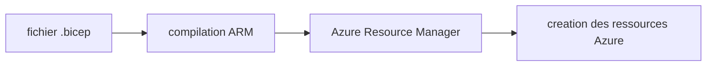
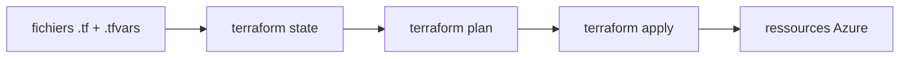
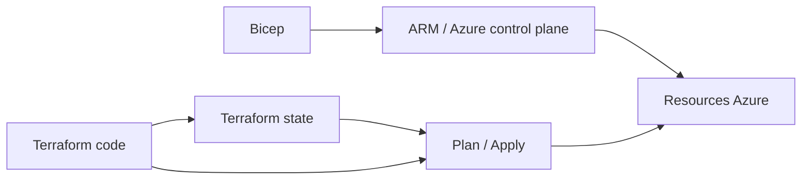

# Partie 2 — Infrastructure as Code & Environnements

## Objectifs
- Démarrer avec Bicep pour comprendre l'IaC Azure-native
- Basculer sur Terraform pour la gestion opérationnelle de `dev`/`prod`
- Comprendre la séparation `dev`/`prod`
- Comparer Bicep et Terraform sur une même architecture

## Pourquoi cette partie existe

Jusqu'ici, vous avez manipulé Azure « à la main » ou via quelques scripts. Le but de la Partie 2 est de passer à une logique **Infrastructure as Code (IaC)** :
- l'infrastructure est décrite dans des fichiers
- ces fichiers sont relus, versionnés et revus dans Git
- un environnement peut être recréé de manière fiable
- les écarts entre la documentation et l'état réel dans Azure diminuent

En pratique, vous allez créer la même famille de ressources avec deux approches :
- **Bicep** pour comprendre la logique Azure-native
- **Terraform** pour la gestion opérationnelle de la suite du lab

## Bicep vs Terraform en clair

### Bicep

Bicep est le langage IaC natif de l'écosystème Azure. Vous décrivez des ressources Azure, puis Azure Resource Manager se charge du déploiement.

Schéma mental :



Ce que Bicep apporte dans ce lab :
- montrer comment Azure modélise ses ressources et leurs dépendances
- décrire une infra Azure de manière lisible
- rester très proche des concepts natifs Azure

### Terraform

Terraform est un outil IaC multi-cloud et multi-providers. Il conserve un **state** qui représente l'infrastructure qu'il pense gérer, puis compare :
- ce qui est décrit dans le code
- ce qui est déjà dans le state
- ce qu'il faut créer, modifier ou détruire

Schéma mental :



Ce que Terraform apporte dans ce lab :

- séparer clairement `dev` et `prod`
- garder un state distant partageable
- rendre les changements plus explicites via `plan`
- s'intégrer facilement dans une logique d'exploitation et de CI/CD

### Comparaison simple



En résumé :

- **Bicep** : excellent pour comprendre et décrire Azure de façon native
- **Terraform** : plus adapté ici pour gérer des environnements durables et reproductibles

## Ce qui est conservé pour la suite

Pour la suite du lab, **Terraform est la source principale d'infrastructure**.

Pourquoi :
- gérer `dev` et `prod` avec la même structure
- disposer d'un `terraform plan` lisible avant chaque changement
- utiliser un backend distant pour garder un state propre et partagé
- s'appuyer sur un outillage courant en contexte plateforme / exploitation

Ce qui est conservé précisément :
- le dossier `infrastructure/terraform/`
- les fichiers `environments/dev.tfvars` et `environments/prod.tfvars`
- le backend distant `tfstate`

Ce qui n'est pas conservé comme chemin principal :
- la démo Bicep du début de la Partie 2 (utile pédagogiquement mais pas retenue comme socle pour les Parties 3/4/5)

Vue d'ensemble :

```text
Partie 2 :
  Bicep      -> comprendre l'approche Azure-native
  Terraform  -> mettre en place l'infra retenue

Parties 3/4/5 :
  Terraform              -> faire évoluer et relire l'infra des environnements
  AML / CI-CD / serving  -> s'appuyer sur cette infra
```

## Atelier

### 1. Démo Bicep rapide (15 min — si rôle `Contributor` sur la subscription)

Lancez un déploiement Bicep minimal pour voir comment Azure Resource Manager interprète un fichier `.bicep`, sans impacter l'infrastructure Terraform du lab :

```bash
# Assurez-vous d'etre connecte : az login
bash scripts/deploy-bicep-demo.sh rg-mlopslab-bicep-demo westeurope
```

Objectif : voir le flux Bicep en mode **lite** (coût et temps réduits).

Ce que cette démo illustre :
- un déploiement déclaratif Azure-native
- la notion de ressources et de dépendances
- un cycle rapide pour comprendre la mécanique IaC sans installer toute la structure Terraform

Option avancée (Bicep complet avec garde-fous) :

```bash
# Garde-fous integres : project_name unique obligatoire + RG reserves bloques
bash scripts/deploy-bicep-full.sh dev mlopsteam01 rg-mlopsteam01-dev westeurope
```

### 2. Préparer le backend Terraform (10 min)

Terraform stocke par défaut son state (qui décrit les ressources qu'il gère) dans un fichier local `terraform.tfstate`. Pour un usage d'équipe, il faut le déplacer sur un **backend distant**. Vous allez créer un Storage Account Azure qui hébergera ce state :

```bash
# 1) Charger les variables d'environnement du backend (TFSTATE_RG, TFSTATE_SA, TFSTATE_CONTAINER, LAB_*)
source lab/env/partie2.env

# 2) Creer le compte de stockage Azure (Standard_LRS suffit pour un lab)
az storage account create \
  --name "$TFSTATE_SA" \
  --resource-group "$TFSTATE_RG" \
  --sku Standard_LRS

# 3) Creer le conteneur qui portera le fichier d'etat
az storage container create \
  --name "$TFSTATE_CONTAINER" \
  --account-name "$TFSTATE_SA"
```

Ce que cette étape fait :
- réutilise le resource group `tfstate` créé pendant la Partie 0
- crée un Storage Account Azure
- crée un conteneur `tfstate`
- permet à Terraform de stocker son state à distance plutôt qu'en local

> [!INFO]
> Les fichiers `lab/env/partie2.env` et `lab/env/naming.env` centralisent :
> - la région et le nom du resource group `tfstate`
> - le nom du conteneur et la convention de nommage du storage account
> - le **suffixe partagé** (`LAB_SUFFIX`) à réutiliser pour tous les noms susceptibles d'entrer en conflit dans la subscription
>
> Ces fichiers sont versionnés : ils ne contiennent **aucun secret**. Tous les participants partent ainsi de la même base.

Pourquoi un backend distant est important :
- éviter les states locaux perdus ou divergents
- faciliter le travail en équipe
- préparer un fonctionnement proche d'un vrai projet

### 3. Déployer l'environnement `dev` avec Terraform (25 min)

Vous allez maintenant initialiser Terraform sur le backend distant, générer un plan, puis créer l'infrastructure `dev`.

```bash
# 1) Charger les variables d'environnement
source lab/env/partie2.env

# 2) Se placer dans le dossier Terraform
cd infrastructure/terraform

# 3) Initialiser Terraform + configurer le backend distant (premiere fois)
terraform init \
  -backend-config="resource_group_name=$TFSTATE_RG" \
  -backend-config="storage_account_name=$TFSTATE_SA" \
  -backend-config="container_name=$TFSTATE_CONTAINER" \
  -backend-config="key=mlopslab-dev.tfstate"

# 3bis) UNIQUEMENT si Terraform a deja ete initialise avec une autre config,
#       utiliser -reconfigure pour forcer le changement de backend
terraform init -reconfigure \
  -backend-config="resource_group_name=$TFSTATE_RG" \
  -backend-config="storage_account_name=$TFSTATE_SA" \
  -backend-config="container_name=$TFSTATE_CONTAINER" \
  -backend-config="key=mlopslab-dev.tfstate"

# 4) Afficher le plan (diff entre le state et le code) sans rien modifier
terraform plan \
  -var-file="environments/dev.tfvars" \
  -var="project_name=$LAB_PROJECT_NAME"

# 5) Appliquer le plan : cree reellement les ressources dans Azure
terraform apply \
  -var-file="environments/dev.tfvars" \
  -var="project_name=$LAB_PROJECT_NAME"
```

Ce que fait chaque commande :
- `terraform init` : prépare le provider Azure et connecte le backend distant
- `terraform plan` : montre ce que Terraform va créer / modifier / détruire
- `terraform apply` : exécute le plan et crée les ressources du lab pour `dev`

Ressources principales créées :
- Resource Group
- Storage Account
- Key Vault
- Azure Container Registry (ACR)
- Log Analytics Workspace + Application Insights
- Azure ML Workspace
- Azure Kubernetes Service (AKS)

> [!WARNING]
> **Point coût** : `dev` crée un cluster AKS avec `1 x Standard_D2s_v3`. Acceptable pour un lab court, mais pas gratuit.
>
> Recommandations :
> - déployer **au minimum** l'environnement `dev`
> - prévoir un `terraform destroy -var-file="environments/dev.tfvars"` en fin de session si le cluster ne sert plus
> - ne pas laisser AKS tourner inutilement pendant la nuit ou plusieurs jours

### 3bis. Attribuer les rôles Azure à l'app GitHub (5 min)

Une fois les resource groups du lab créés, attribuez les rôles Azure à votre application `$GITHUB_APP_NAME` (Service Principal utilisé plus tard par les workflows CI/CD via OIDC).

```bash
# 1) Sourcer les variables et resoudre l'identite de l'app GitHub
source lab/env/partie2.env
PRINCIPAL_ID=$(az ad sp list --display-name "$GITHUB_APP_NAME" --query "[0].id" -o tsv)
SUBSCRIPTION_ID=$(az account show --query id -o tsv)

# 2) Sanity check (les 3 variables doivent être non vides)
echo "PID=$PRINCIPAL_ID  SUB=$SUBSCRIPTION_ID  TFSTATE_RG=$TFSTATE_RG  DEV_RG=$AML_RESOURCE_GROUP_DEV"

# 3) Contributor sur le RG backend Terraform
az role assignment create \
  --assignee-object-id "$PRINCIPAL_ID" \
  --assignee-principal-type ServicePrincipal \
  --role "Contributor" \
  --scope "/subscriptions/$SUBSCRIPTION_ID/resourceGroups/$TFSTATE_RG"

# 4) Contributor sur le RG dev du lab
az role assignment create \
  --assignee-object-id "$PRINCIPAL_ID" \
  --assignee-principal-type ServicePrincipal \
  --role "Contributor" \
  --scope "/subscriptions/$SUBSCRIPTION_ID/resourceGroups/$AML_RESOURCE_GROUP_DEV"

# 5) User Access Administrator sur le RG dev (nécessaire pour les assignations AcrPull créées par Terraform)
az role assignment create \
  --assignee-object-id "$PRINCIPAL_ID" \
  --assignee-principal-type ServicePrincipal \
  --role "User Access Administrator" \
  --scope "/subscriptions/$SUBSCRIPTION_ID/resourceGroups/$AML_RESOURCE_GROUP_DEV"
```

> [!TIP]
> - **`--assignee-principal-type ServicePrincipal`** évite l'erreur `PrincipalNotFound` due au délai de réplication Entra quand la SP vient d'être créée. Un Service Principal est l'identité associée à une App Registration.
> - Si vous ouvrez un **nouveau shell**, relancez l'étape 1 : les variables `$PRINCIPAL_ID`, `$SUBSCRIPTION_ID`, etc. ne persistent pas.

<br>
<details>
<summary>Environnement prod (pour information)</summary>

Pour l'environnement `prod` (**ne pas lancer ici**), ajoutez en plus :

```bash
az role assignment create \
  --assignee-object-id "$PRINCIPAL_ID" \
  --assignee-principal-type ServicePrincipal \
  --role "Contributor" \
  --scope "/subscriptions/$SUBSCRIPTION_ID/resourceGroups/$AML_RESOURCE_GROUP_PROD"

az role assignment create \
  --assignee-object-id "$PRINCIPAL_ID" \
  --assignee-principal-type ServicePrincipal \
  --role "User Access Administrator" \
  --scope "/subscriptions/$SUBSCRIPTION_ID/resourceGroups/$AML_RESOURCE_GROUP_PROD"
```
</details>
<br>

Pourquoi `User Access Administrator` :
- Terraform (et Bicep) crée l'assignation `AcrPull` entre AKS et ACR
- sans `User Access Administrator` (ou `Owner`), la création de `roleAssignments` échoue
- le scope reste strictement limité aux resource groups du lab

Vérification rapide après attribution :

```bash
source lab/env/partie2.env
PRINCIPAL_ID=$(az ad sp list --display-name "$GITHUB_APP_NAME" --query "[0].id" -o tsv)
az role assignment list --assignee "$PRINCIPAL_ID" --query "[].{role:roleDefinitionName,scope:scope}" -o table
```

Vous devez voir au minimum :
- `Contributor` sur `$TFSTATE_RG`
- `Contributor` sur `$AML_RESOURCE_GROUP_DEV`
- `User Access Administrator` sur `$AML_RESOURCE_GROUP_DEV`

Si l'environnement `prod` est également créé :
- `Contributor` sur `$AML_RESOURCE_GROUP_PROD`
- `User Access Administrator` sur `$AML_RESOURCE_GROUP_PROD`

### 4. Terraform `prod` (optionnel, 10 min)

> [!WARNING]
> **Étape optionnelle, impact coût.**
>
> Elle illustre la séparation `dev` / `prod` mais crée une infra sensiblement plus chère que `dev`. La configuration actuelle de `prod` crée un cluster AKS avec `2 x Standard_D4s_v3`.
>
> **Ne lancez cette étape que si c'est explicitement demandé.** Sinon, rester sur `dev` suffit pour valider les objectifs de la Partie 2.

```bash
source lab/env/partie2.env
cd infrastructure/terraform
terraform init -reconfigure \
  -backend-config="resource_group_name=$TFSTATE_RG" \
  -backend-config="storage_account_name=$TFSTATE_SA" \
  -backend-config="container_name=$TFSTATE_CONTAINER" \
  -backend-config="key=mlopslab-prod.tfstate"

terraform plan -var-file="environments/prod.tfvars" -var="project_name=$LAB_PROJECT_NAME"
terraform apply -var-file="environments/prod.tfvars" -var="project_name=$LAB_PROJECT_NAME"
```

Ce que cette étape illustre pédagogiquement :
- la même base d'infrastructure
- avec un fichier de variables différent
- donc un environnement séparé avec son propre state

Si vous lancez `prod` pour la démo :
- vérifiez le `terraform plan` avant `apply`
- détruisez l'environnement à la fin : `terraform destroy -var-file="environments/prod.tfvars"`
- ne considérez pas cette configuration comme une vraie prod

**Alternative « prod low cost »** (uniquement pour tester la commande) :
- dupliquez `environments/prod.tfvars` dans un fichier temporaire, par exemple `environments/prod-lowcost.tfvars`
- réduisez la taille à `aks_node_count = 1` et `aks_vm_size = "Standard_D2s_v3"`
- lancez `plan` / `apply` avec ce fichier temporaire
- détruisez juste après le test

Exemple :
```bash
cp environments/prod.tfvars environments/prod-lowcost.tfvars
# puis editer prod-lowcost.tfvars:
# aks_node_count = 1
# aks_vm_size    = "Standard_D2s_v3"

terraform plan -var-file="environments/prod-lowcost.tfvars"
terraform apply -var-file="environments/prod-lowcost.tfvars"
terraform destroy -var-file="environments/prod-lowcost.tfvars"
```

Pour une vraie production :
- dimensionnez AKS selon la charge réelle, pas « au plus petit »
- utilisez au minimum plusieurs nœuds et une capacité compatible avec la haute disponibilité
- définissez des exigences claires sur disponibilité, supervision, sauvegarde, réseau et sécurité
- revoyez le SKU ACR, les logs, les policies et le dimensionnement avant toute mise en service

### 5. Vérification et comparaison (10 min)

Vérifiez l'infrastructure via Terraform et Azure CLI :

```bash
source lab/env/partie2.env
echo "RG dev: $AML_RESOURCE_GROUP_DEV"

# Sorties Terraform (AML / AKS / ACR)
cd infrastructure/terraform
terraform output

# Inventaire du resource group dev
az resource list --resource-group "$AML_RESOURCE_GROUP_DEV" \
  --query "[].{name:name, type:type}" -o table
```

Attendu : environ 7 ressources dans `$AML_RESOURCE_GROUP_DEV` :
- Storage Account
- Key Vault
- Container Registry (ACR)
- Log Analytics Workspace
- Application Insights
- Azure ML Workspace
- AKS Cluster

Vérifications complémentaires :
- **Portail Azure** : ouvrez le RG `$AML_RESOURCE_GROUP_DEV` (valeur exacte dépend de votre `LAB_SUFFIX`) et vérifiez visuellement les ressources.
- **Lecture comparée** : ouvrez `infrastructure/terraform-reference/` pour voir une version simplifiée et comparer les patterns avec l'implémentation complète.

### 6. Bootstrap des assets AML (recommandé avant la Partie 3, 10 min)

Une fois l'infrastructure `dev` créée, préparez les assets AML utilisés ensuite par les workflows :
- environnement AML `iris-train-env`
- compute `cpu-cluster`
- health-check AML simple

Lancez depuis la racine du dépôt :

```bash
source lab/env/partie2.env
bash scripts/bootstrap-aml.sh dev "$AML_RESOURCE_GROUP_DEV" "$AML_WORKSPACE_DEV" true
```

> [!INFO]
> Cette commande peut prendre plusieurs minutes, surtout au premier passage. La partie la plus lente est généralement le health-check AML : Azure ML doit préparer le compute, l'environnement et le conteneur avant d'exécuter le code. Si le script semble « attendre », ce n'est pas forcément un blocage.

Ce que fait ce script :
- crée ou met à jour l'environnement AML
- crée ou met à jour le compute AML
- vérifie l'identité du compute et l'accès `AcrPull` sur l'ACR
- soumet un petit job AML de vérification

Pourquoi le lancer ici :
- à ce stade, `$AML_RESOURCE_GROUP_DEV` et `$AML_WORKSPACE_DEV` existent vraiment
- la cohérence avec Terraform comme source de vérité est préservée
- le passage vers la Partie 3 sera plus fluide

> [!NOTE]
> Le script peut être relancé sans danger. Le workflow de la Partie 3 sait aussi recréer ou corriger ces assets si nécessaire, mais les vérifier en fin de Partie 2 permet d'isoler les problèmes AML avant la CI/CD complète.

## Questions de clarification

Avant de passer à la Partie 3, vous devez pouvoir répondre aux questions suivantes :
- Que fait Bicep dans Azure, sans notion de state Terraform ?
- À quoi sert le backend `tfstate` ?
- Pourquoi `dev` et `prod` ont-ils des fichiers de variables différents ?
- Pourquoi la suite du lab s'appuie sur Terraform plutôt que sur la démo Bicep ?

## Checkpoint Partie 2
- [ ] 7 ressources dans `$AML_RESOURCE_GROUP_DEV`
- [ ] Terraform state distant configuré
- [ ] Outputs Terraform visibles (workspace + AKS + ACR)
- [ ] Bootstrap AML passé ou compris avant la Partie 3
- [ ] Différences Bicep vs Terraform expliquées
