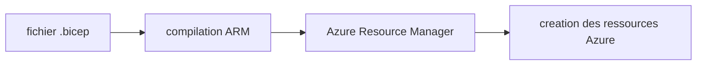
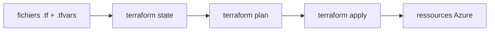
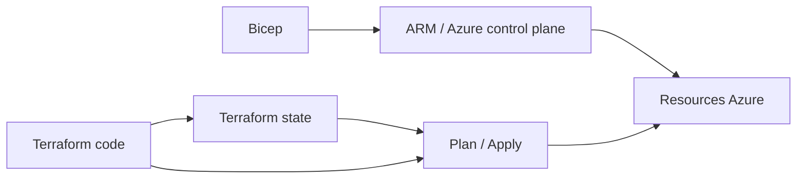

# Jour 2 — Infrastructure as Code & Environnements

## Objectifs
- Demarrer avec Bicep pour comprendre l'IaC Azure-native
- Basculer sur Terraform pour la gestion operationnelle de dev/prod
- Comprendre la separation dev/prod
- Comparer Bicep vs Terraform sur une meme architecture

## Pourquoi ce jour existe

Jusqu'ici, on a surtout manipule Azure "a la main" ou via quelques scripts.
Le but du Jour 2 est de passer a une logique **Infrastructure as Code (IaC)**:
- l'infrastructure est decrite dans des fichiers
- ces fichiers peuvent etre relus, versionnes et revus dans Git
- on peut recreer un environnement de maniere plus fiable
- on reduit les ecarts entre ce qui est documente et ce qui existe vraiment dans Azure

En pratique, on va creer la meme famille de ressources avec deux approches:
- **Bicep** pour comprendre la logique Azure-native
- **Terraform** pour la gestion operationnelle de la suite du lab

## Bicep vs Terraform en clair

### Bicep

Bicep est le langage IaC natif de l'ecosysteme Azure.
On decrit des ressources Azure, puis Azure Resource Manager se charge du deploiement.

Schema mental:



Ce que Bicep fait bien dans ce lab:
- montrer comment Azure pense ses ressources et leurs dependances
- decrire une infra Azure de maniere lisible
- rester tres proche des concepts natifs Azure

### Terraform

Terraform est un outil IaC multi-cloud et multi-providers.
Il conserve un **state** qui represente l'infrastructure qu'il pense gerer, puis compare:
- ce qui est decrit dans le code
- ce qui est deja dans le state
- ce qu'il faut creer, modifier ou detruire

Schema mental:



Ce que Terraform fait dans ce lab:

- separer clairement `dev` et `prod`
- garder un state distant partageable
- rendre les changements plus explicites via `plan`
- s'integrer facilement dans une logique d'exploitation et de CI/CD

### Comparaison simple



En résumé:

- **Bicep** = excellent pour comprendre et decrire Azure de facon native
- **Terraform** = plus adapte ici pour gérer des environnements durables et répétables

## Ce qu'on va conserver pour la suite

Pour la suite du lab, on **conserve Terraform comme source principale d'infrastructure**.

Pourquoi:

- on veut gérer `dev` et `prod` avec la même structure
- on veut un `terraform plan` lisible avant les changements
- on veut un backend distant pour garder un state propre
- on veut un outillage courant en contexte plateforme / exploitation

Ce qu'on garde exactement:

- le dossier `infrastructure/terraform/`
- les fichiers `environments/dev.tfvars` et `environments/prod.tfvars`
- le backend distant `tfstate`

Ce qu'on ne garde pas comme chemin principal:
- la demo Bicep du debut de J2

Pourquoi:

- elle sert surtout a comprendre le modèle Azure-native
- elle est utile pedagogiquement, mais ce n'est pas le socle retenu pour J3/J4/J5

Vue d'ensemble:

```text
Partie 2:
  Bicep -> comprendre l'approche Azure-native
  Terraform -> mettre en place l'infra retenue

Parties 3/4/5:
  Terraform -> faire evoluer et relire l'infra des environnements
  AML / CI-CD / deploiement -> s'appuyer sur cette infra
```

## Atelier

### 1. Demo Bicep rapide (15 min - si contributeur Azure seulement)

```bash
# az login
bash scripts/deploy-bicep-demo.sh rg-mlopslab-bicep-demo westeurope
```

Objectif: voir le flux Bicep en mode **lite** (coût + temps reduits) sans impacter les environnements Terraform.

Ce que cette demo montre:

- un deploiement declaratif Azure-native
- la notion de ressources + dependances
- un cycle rapide pour comprendre la mecanique IaC sans installer toute la structure Terraform

Option avancee (full Bicep avec garde-fous):

```bash
# Garde-fous integres: project_name unique obligatoire + RG reservees bloquees
bash scripts/deploy-bicep-full.sh dev mlopsteam01 rg-mlopsteam01-dev westeurope
```

### 2. Preparer le backend Terraform (10 min)
 
 ```bash
 # Source les variables d'environnement pour le backend Terraform
 source lab/env/partie2.env

 # Crée le compte de stockage Azure pour stocker l'état Terraform à distance
 az storage account create --name "$TFSTATE_SA" --resource-group "$TFSTATE_RG" --sku Standard_LRS

 # Crée le conteneur dans le compte de stockage pour isoler les fichiers d'état
 az storage container create --name "$TFSTATE_CONTAINER" --account-name "$TFSTATE_SA"
 ```
 
 Ce que cette etape fait:
- reutilise le resource group `tfstate` cree pendant le setup
 - cree un compte de stockage Azure
 - cree un conteneur `tfstate`
 - permet a Terraform de stocker son state a distance plutot qu'en local

 Le fichier [lab/env/partie2.env](/home/seb/project/azure_lab/mlops-azure-lab/lab/env/partie2.env) centralise:
 - la region du backend
 - le nom du resource group `tfstate`
 - le nom du conteneur
 - la convention de nommage du storage account

 Le fichier [lab/env/naming.env](/home/seb/project/azure_lab/mlops-azure-lab/lab/env/naming.env) centralise:
 - le suffixe partage a reutiliser pour les noms potentiellement en conflit dans la subscription

 Pourquoi on le versionne:
 - il ne contient aucun secret
- tous les participants partent de la meme base
- on garde les commandes visibles, sans recopier des valeurs en dur dans tout le lab

Pourquoi c'est important:
- eviter les states locaux perdus ou divergents
- faciliter le travail en equipe
- preparer un fonctionnement proche d'un vrai projet

### 3. Terraform dev (25 min)
```bash
# Source les variables d'environnement pour le backend Terraform
source lab/env/partie2.env

# Accéder au répertoire Terraform
cd infrastructure/terraform

# Initialiser Terraform avec la configuration du backend distant
# Cela configure la connexion au compte de stockage Azure pour stocker l'état
terraform init \
  -backend-config="resource_group_name=$TFSTATE_RG" \
  -backend-config="storage_account_name=$TFSTATE_SA" \
  -backend-config="container_name=$TFSTATE_CONTAINER" \
  -backend-config="key=mlopslab-dev.tfstate"

# SEULEMENT si déja initialisé, utiliser -reconfigure pour forcer la reconfiguration
terraform init -reconfigure \
  -backend-config="resource_group_name=$TFSTATE_RG" \
  -backend-config="storage_account_name=$TFSTATE_SA" \
  -backend-config="container_name=$TFSTATE_CONTAINER" \
  -backend-config="key=mlopslab-dev.tfstate"

# Afficher le plan Terraform pour l'environnement dev
# Cela montre quelles ressources seront créées, modifiées ou supprimées
terraform plan -var-file="environments/dev.tfvars" -var="project_name=$LAB_PROJECT_NAME"

# Appliquer les changements Terraform pour créer l'infrastructure dev
# Cela crée réellement les ressources dans Azure
terraform apply -var-file="environments/dev.tfvars" -var="project_name=$LAB_PROJECT_NAME"
```

Ce que cette etape fait:
- `init` prepare le provider Azure et connecte le backend distant
- `plan` montre ce que Terraform va creer
- `apply` cree les ressources du lab pour `dev`

Ressources principales creees:
- Resource Group
- Storage Account
- Key Vault
- ACR
- Log Analytics + Application Insights
- AML Workspace
- AKS

Recommandation lab:
- Faire **au minimum** l'environnement `dev`
- Prevoir un `terraform destroy -var-file="environments/dev.tfvars"` en fin de session si le cluster ne sert plus
- Ne pas laisser AKS tourner inutilement pendant la nuit ou plusieurs jours

Point coût:
- `dev` cree un cluster AKS avec `1 x Standard_D2s_v3`
- C'est acceptable pour un lab court, mais ce n'est pas une infra "gratuite"

### 3bis. Attribuer les rôles Azure à l'app GitHub (5 min)
Une fois les resource groups du lab créés, attribuer les rôles Azure à l'app `github-mlops-lab`.

```bash
# 1) Sourcer les variables et résoudre l'identité de l'app GitHub
source lab/env/partie2.env
PRINCIPAL_ID=$(az ad sp list --display-name "github-mlops-lab" --query "[0].id" -o tsv)
SUBSCRIPTION_ID=$(az account show --query id -o tsv)

# 2) Sanity check (les 3 variables doivent être non vides)
echo "PID=$PRINCIPAL_ID  SUB=$SUBSCRIPTION_ID  TFSTATE_RG=$TFSTATE_RG  DEV_RG=$AML_RESOURCE_GROUP_DEV"

# 3) Contributor sur le RG backend Terraform
az role assignment create \
  --assignee-object-id "$PRINCIPAL_ID" \
  --assignee-principal-type ServicePrincipal \
  --role "Contributor" \
  --scope "/subscriptions/$SUBSCRIPTION_ID/resourceGroups/$TFSTATE_RG"

# 4) Contributor sur le RG dev du lab
az role assignment create \
  --assignee-object-id "$PRINCIPAL_ID" \
  --assignee-principal-type ServicePrincipal \
  --role "Contributor" \
  --scope "/subscriptions/$SUBSCRIPTION_ID/resourceGroups/$AML_RESOURCE_GROUP_DEV"

# 5) User Access Administrator sur le RG dev (nécessaire pour les assignations AcrPull créées par Terraform)
az role assignment create \
  --assignee-object-id "$PRINCIPAL_ID" \
  --assignee-principal-type ServicePrincipal \
  --role "User Access Administrator" \
  --scope "/subscriptions/$SUBSCRIPTION_ID/resourceGroups/$AML_RESOURCE_GROUP_DEV"
```

> **Pourquoi `--assignee-principal-type ServicePrincipal`** : évite l'erreur `PrincipalNotFound` due au délai de réplication Entra si la SP (Un Service Principal est l’identité d’une App Registration) vient d'être créée.
>
> **Si tu ouvres un nouveau shell** : relance l'étape 1 (les variables ne persistent pas).

Pour lancer l'étape `prod` (NE PAS FAIRE ICI), ajouter en plus :

```bash
az role assignment create \
  --assignee-object-id "$PRINCIPAL_ID" \
  --assignee-principal-type ServicePrincipal \
  --role "Contributor" \
  --scope "/subscriptions/$SUBSCRIPTION_ID/resourceGroups/$AML_RESOURCE_GROUP_PROD"

az role assignment create \
  --assignee-object-id "$PRINCIPAL_ID" \
  --assignee-principal-type ServicePrincipal \
  --role "User Access Administrator" \
  --scope "/subscriptions/$SUBSCRIPTION_ID/resourceGroups/$AML_RESOURCE_GROUP_PROD"
```

Pourquoi ce rôle :
- Terraform/Bicep crée l'assignation `AcrPull` entre AKS et ACR
- sans `User Access Administrator` ou `Owner`, la création de `roleAssignments` échoue
- le scope reste limité aux resource groups du lab

Verification rapide apres attribution des rôles :

```bash
PRINCIPAL_ID=$(az ad sp list --display-name "github-mlops-lab" --query "[0].id" -o tsv)
az role assignment list --assignee "$PRINCIPAL_ID" --query "[].{role:roleDefinitionName,scope:scope}" -o table
```

Tu dois voir au minimum :
- `Contributor` sur `$TFSTATE_RG`
- `Contributor` sur `$AML_RESOURCE_GROUP_DEV`
- `User Access Administrator` sur `$AML_RESOURCE_GROUP_DEV`

Si l'environnement `prod` est aussi créé :
- `Contributor` sur `$AML_RESOURCE_GROUP_PROD`
- `User Access Administrator` sur `$AML_RESOURCE_GROUP_PROD`

### 4. Terraform prod (optionnel, 10 min)
 > **Important — optionnel pour raison de cout**
 >
 > Cette etape est **optionnelle**. Elle existe pour illustrer la separation `dev` / `prod`,
> mais elle cree une infra sensiblement plus chere que `dev`.
>
> La configuration actuelle `prod` cree un cluster AKS avec `2 x Standard_D4s_v3`.
> Pour un lab, **ne lancer cette etape que si c'est explicitement demande**.
> Sinon, rester sur `dev` suffit pour valider les objectifs du Jour 2.

```bash
source lab/env/partie2.env
cd infrastructure/terraform
terraform init -reconfigure \
  -backend-config="resource_group_name=$TFSTATE_RG" \
  -backend-config="storage_account_name=$TFSTATE_SA" \
  -backend-config="container_name=$TFSTATE_CONTAINER" \
  -backend-config="key=mlopslab-prod.tfstate"

terraform plan -var-file="environments/prod.tfvars" -var="project_name=$LAB_PROJECT_NAME"
terraform apply -var-file="environments/prod.tfvars" -var="project_name=$LAB_PROJECT_NAME"
```

Ce que cette etape montre pedagogiquement:
- la meme base d'infrastructure
- mais avec un fichier de variables different
- donc un environnement separe avec son propre state

Si tu lances quand meme `prod` pour la demo:
- verifier le `terraform plan` avant `apply`
- detruire l'environnement a la fin avec `terraform destroy -var-file="environments/prod.tfvars"`
- ne pas considerer cette configuration comme une vraie prod

Si tu veux une "prod low cost" uniquement pour tester la commande:
- dupliquer `environments/prod.tfvars` dans un fichier temporaire, par exemple `environments/prod-lowcost.tfvars`
- reduire temporairement la taille a `aks_node_count = 1` et `aks_vm_size = "Standard_D2s_v3"`
- lancer `plan/apply` avec ce fichier temporaire
- detruire juste apres le test

Exemple:
```bash
cp environments/prod.tfvars environments/prod-lowcost.tfvars
# puis editer prod-lowcost.tfvars:
# aks_node_count = 1
# aks_vm_size    = "Standard_D2s_v3"

terraform plan -var-file="environments/prod-lowcost.tfvars"
terraform apply -var-file="environments/prod-lowcost.tfvars"
terraform destroy -var-file="environments/prod-lowcost.tfvars"
```

Pour une vraie production:
- dimensionner AKS selon la charge reelle, pas "au plus petit"
- utiliser au minimum plusieurs nœuds et une capacite compatible avec la haute disponibilite
- definir des exigences claires sur disponibilite, supervision, sauvegarde, reseau et securite
- revoir le SKU ACR, les logs, les policies et le dimensionnement avant toute mise en service

### 5. Verification + comparaison (10 min)

Verification via Terraform et Azure CLI :

```bash
source lab/env/partie2.env
echo "RG dev: $AML_RESOURCE_GROUP_DEV"

# Sorties Terraform (AML / AKS / ACR)
cd infrastructure/terraform
terraform output

# Inventaire du resource group dev
az resource list --resource-group "$AML_RESOURCE_GROUP_DEV" \
  --query "[].{name:name, type:type}" -o table
```

Attendu : environ 7 ressources dans `$AML_RESOURCE_GROUP_DEV` :
- Storage Account
- Key Vault
- Container Registry (ACR)
- Log Analytics Workspace
- Application Insights
- Azure ML Workspace
- AKS Cluster

Autres checks :
- **Portail Azure** : ouvrir le RG `$AML_RESOURCE_GROUP_DEV` (valeur exacte dépend de ton `LAB_SUFFIX`) et vérifier visuellement les ressources.
- **Lecture comparée** : ouvrir `infrastructure/terraform-reference/` pour voir une version simplifiée et comparer les patterns.

### 6. Bootstrap AML assets (recommande avant J3, 10 min)
Une fois l'infrastructure `dev` creee, on peut preparer les assets AML utilises ensuite par les workflows:
- environnement AML `iris-train-env`
- compute `cpu-cluster`
- health-check AML simple

Commande à lancer depuis la racine du repo :

```bash
source lab/env/partie2.env
bash scripts/bootstrap-aml.sh dev "$AML_RESOURCE_GROUP_DEV" "$AML_WORKSPACE_DEV" true
```

Note:
- cette commande peut prendre plusieurs minutes, surtout au premier passage
- la partie la plus lente est souvent le health-check AML, car Azure ML doit preparer le compute, l'environnement et le conteneur avant d'executer le code
- si le script semble "attendre", ce n'est pas forcement un blocage

Ce que fait ce script:
- cree ou met a jour l'environnement AML
- cree ou met a jour le compute AML
- verifie l'identite du compute et l'acces `AcrPull` sur l'ACR
- soumet un petit job AML de verification

Pourquoi le lancer ici:
- a ce moment, `$AML_RESOURCE_GROUP_DEV` et `$AML_WORKSPACE_DEV` existent vraiment
- on reste coherent avec Terraform comme source de verite pour l'infra
- on prepare un passage plus fluide vers le Jour 3

Important:
- le script peut etre relance sans danger si besoin
- pour un repo a jour, le workflow du Jour 3 sait aussi recreer/corriger ces assets si necessaire
- mais le lancer en fin de Jour 2 permet de verifier AML avant la CI/CD complete

Questions a savoir expliquer a la fin:
- Que fait Bicep dans Azure, sans notion de state Terraform ?
- A quoi sert le backend `tfstate` ?
- Pourquoi `dev` et `prod` ont des fichiers de variables differents ?
- Pourquoi la suite du lab s'appuie sur Terraform plutot que sur la demo Bicep ?

## Checkpoint J2
- [ ] 7 ressources dans `$AML_RESOURCE_GROUP_DEV`
- [ ] Terraform state distant configure
- [ ] Outputs Terraform visibles (workspace + AKS + ACR)
- [ ] Bootstrap AML passe ou compris avant J3
- [ ] Differences Bicep vs Terraform expliquees
