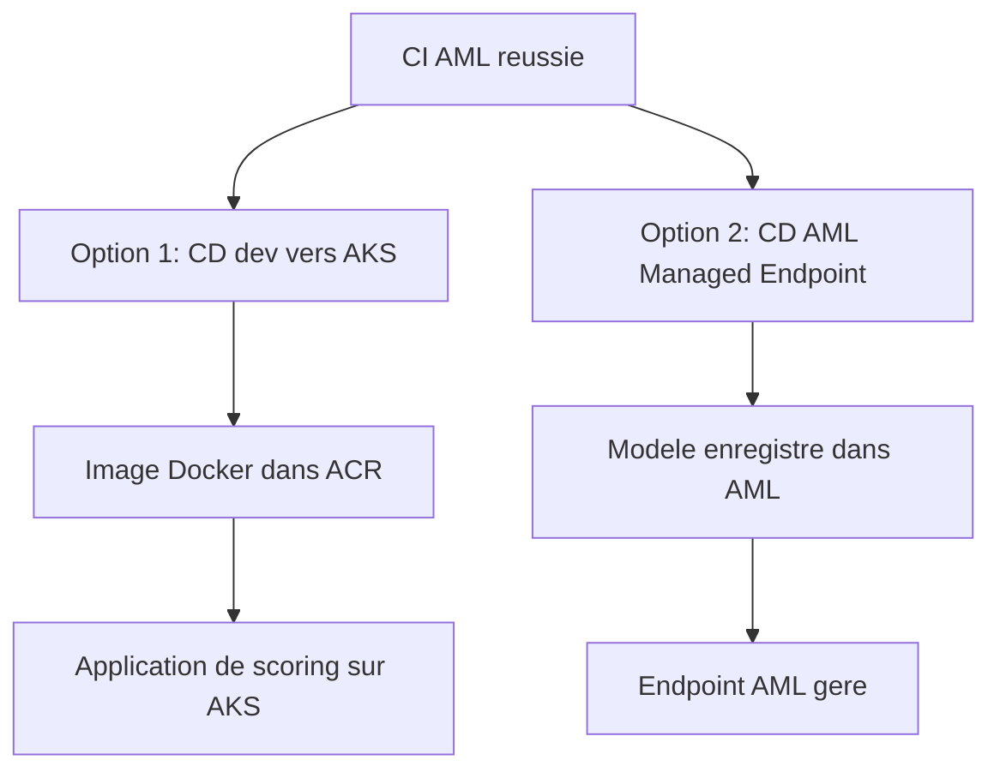
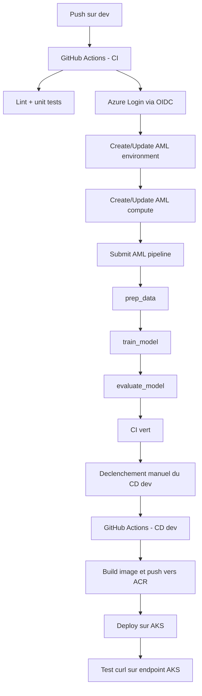
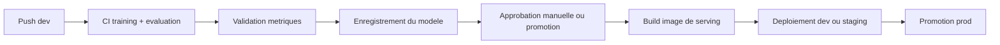
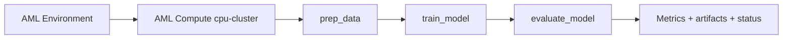
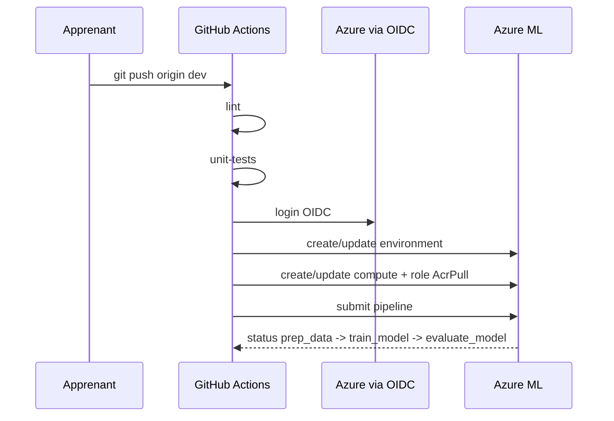

# Partie 3 — CI/CD pour le Machine Learning

## Objectifs
- Comprendre Azure Pipelines et GitHub Actions (théorie)
- Lire et comprendre les 3 workflows CI/CD principaux du dépôt
- Relier ce que vous avez testé dans le notebook de la Partie 1 avec son exécution automatisée en CI
- Déclencher un CI réel (`commit` → pipeline AML)
- Observer le déploiement AKS de bout en bout

## Théorie : Azure Pipelines vs GitHub Actions (40 min)

### Même concept, deux syntaxes

Les deux systèmes font la même chose : détecter un événement (push, tag, timer), exécuter des steps dans un runner (VM temporaire), interagir avec Azure. La différence est dans l'écosystème et la syntaxe YAML.

```yaml
# Azure Pipelines (azure-pipelines.yml)    # GitHub Actions (.github/workflows/ci.yml)
trigger:                                    on:
  branches:                                   push:
    include: [main]                             branches: [main]

pool:                                       jobs:
  vmImage: ubuntu-latest                      train:
                                               runs-on: ubuntu-latest
steps:
- task: AzureCLI@2                             steps:
  inputs:                                      - uses: actions/checkout@v4
    azureSubscription: 'my-conn'               - uses: azure/login@v2
    scriptType: bash                             with:
    inlineScript: |                                client-id: ${{ secrets.AZURE_CLIENT_ID }}
      az ml job create \                       - run: az ml job create \
        --file pipeline.yml                          --file mlops/pipelines/pipeline.yml
```

### Différences clés

| | Azure Pipelines | GitHub Actions |
|---|---|---|
| Hébergement | `dev.azure.com` (portail séparé) | `github.com` (même repo) |
| Auth Azure | Service Connection (UI) | OIDC (Federated Credentials) |
| Réutilisabilité | Templates YAML | Reusable Workflows |
| Écosystème | Azure-first | Open source / multi-cloud |
| Visibilité YAML | Dans le dépôt | Dans le dépôt |
| Courbe d'apprentissage | Légèrement plus verbeux | Plus concis |

### Quand voir Azure DevOps en entreprise ?
- Grandes entreprises avec licences Microsoft existantes
- Projets qui utilisent déjà Azure Repos (git intégré à ADO)
- Équipes qui veulent tout dans un seul portail Azure

> [!NOTE]
> **Pour ce lab : GitHub Actions.** Le YAML est dans le dépôt, vous le voyez et le modifiez directement sans naviguer vers un portail supplémentaire.

---

## Ce qui se passe derrière les workflows

Le point important de la Partie 3 est qu'un `git push` ne lance pas seulement des tests Python : il déclenche la CI, puis vous lancez volontairement le CD `dev` à la main pour garder le contrôle sur le build, le push d'image et le déploiement.

> [!IMPORTANT]
> Dans ce lab, le déploiement AKS juste après un CI vert est un **raccourci pédagogique**. L'objectif est de montrer la chaîne complète de bout en bout en une seule partie.
>
> En pratique, on sépare plus souvent : entraînement → enregistrement du modèle → validation → déploiement. Lisez donc ce flux comme un environnement `dev` de démonstration, pas comme un modèle de production à recopier tel quel.

## Deux cibles de déploiement différentes

Le dépôt montre volontairement **deux manières de servir un modèle** après l'entraînement. Elles ne font pas la même chose et ne servent pas le même objectif.

| Cible | Ce qui est déployé | Qui gère le runtime | Ce que vous manipulez | Usage dans le lab |
|---|---|---|---|---|
| `AKS` | image Docker de scoring | vous via Kubernetes | image ACR, manifest K8s, service, rollout | montrer le chemin conteneur + ACR + AKS |
| `Managed Endpoint AML` | endpoint de modèle Azure ML | Azure ML | modèle AML, endpoint AML, deployment AML | montrer le chemin serving ML géré et le registre de modèles |

En lecture simple :
- `AKS` = approche « plateforme / Kubernetes »
- `Managed Endpoint AML` = approche « service de serving ML géré »

Conséquences concrètes :
- déployer sur `AKS` **n'enregistre pas** automatiquement un modèle dans le registre AML
- déployer un `Managed Endpoint AML` **enregistre** le modèle dans le workspace AML puis le sert via Azure ML
- la Partie 4 dépend donc du workflow `Managed Endpoint AML` pour la partie registre de modèles, pas du workflow AKS

Schéma de séparation :


Vue d'ensemble du flux :


Pourquoi cela peut prendre du temps :
- GitHub doit d'abord démarrer un runner
- Azure Login via OIDC doit obtenir un token
- AML doit préparer ou mettre à jour l'environnement d'exécution
- le compute `cpu-cluster` peut devoir sortir de veille si `min-instances = 0`
- AML doit tirer l'image Docker depuis l'ACR
- le pipeline AML enchaîne ensuite `prep_data`, `train_model`, `evaluate_model`
- après un CI vert, vous pouvez lancer manuellement le workflow CD `dev` qui construit l'image applicative et la déploie sur AKS

Ce qui serait plus fréquent en conditions réelles :


> [!INFO]
> Ouvrez `.github/workflows/ci-train.yml`, `cd-deploy-dev.yml`, `cd-deploy-prod.yml` et `mlops/pipelines/pipeline.yml` : qu'est-ce qui est exécuté automatiquement, qu'est-ce qui reste manuel, et qu'est-ce qui est couplé trop tôt ?
> Les **anti-patterns** à repérer ici sont : modèle embarqué dans l'image Docker au build, absence d'enregistrement du modèle dans le pipeline AML, et promotion vers `prod` trop proche de la construction technique.
> Les **bonnes pratiques** correspondantes sont : séparation training / serving, enregistrement du modèle comme artefact versionné, et promotion explicite avec validation avant passage d'environnement.

En pratique, le script Python `prep.py` est très rapide. Si l'étape `prep_data` semble longue, le temps est souvent consommé par :
- le réveil du compute AML
- la préparation du conteneur
- le pull de l'image
- les opérations d'infrastructure AML avant l'exécution du code

Schéma du pipeline AML :


À observer dans AML Studio :
- `Queued` ou `Preparing` : AML prépare l'infra, pas encore votre code
- `Running` sur `prep_data` : le conteneur du step est lancé
- `Completed` : le step est terminé
- `Failed` : regardez les logs du child job concerné

> [!TIP]
> - premier run après création du compute : plus lent
> - runs suivants : souvent plus rapides grâce au cache AML
> - ce qui paraît « lent » n'est pas forcément un bug, surtout au premier passage

> [!INFO]
> Ouvrez `.github/workflows/ci-train.yml` et repérez la boucle `for attempt in $(seq 1 40)` qui interroge AML toutes les 30 secondes : qu'est-ce qui se passe si le job dépasse 20 minutes ?
> L'**anti-pattern** ici est le polling actif : le workflow bloque un runner GitHub pendant toute la durée du job AML, consomme du quota CI et peut rater la fin si le job dépasse le timeout.
> La **bonne pratique** est de découpler : déclencher le job AML, puis laisser un événement (webhook Azure Event Grid ou `workflow_run`) notifier GitHub quand c'est terminé, sans maintenir un runner ouvert.

> [!NOTE]
> **Positionnement de `bootstrap-aml.sh`** : il prépare les assets AML après création de l'infrastructure. Le meilleur moment pour le lancer manuellement est en fin de Partie 2. Dans la Partie 3, avec un dépôt à jour, le workflow CI sait normalement faire le nécessaire sans bootstrap manuel. Si un environnement a été créé avant les derniers correctifs, relancer `bootstrap-aml.sh` reste un bon outil de rattrapage.

## Atelier

### 1. Lire les workflows (15 min)

Ouvrez `.github/workflows/` et répondez :
- Qu'est-ce qui déclenche `ci-train.yml` ?
- Pourquoi `train-pipeline` a-t-il `environment: dev` ?
- Que font les 3 commandes `sed` dans `cd-deploy-dev.yml` ?
- Pourquoi `cd-deploy-prod.yml` nécessite-t-il `environment: production` ?
- Quelles étapes du notebook de la Partie 1 sont reprises dans les scripts `prep.py`, `train.py`, `evaluate.py` ?

### 2. Premier push sur `dev` (10 min)

Avant le push, vérifiez que l'identité GitHub OIDC a bien les droits sur le workspace créé en Partie 2. Sans cela, le job `train-pipeline` échoue typiquement sur `az ml environment create`.

Vérifications conseillées :
```bash
source lab/env/partie2.env
PRINCIPAL_ID=$(az ad sp list --display-name "$GITHUB_APP_NAME" --query "[0].id" -o tsv)

az role assignment list \
  --assignee "$PRINCIPAL_ID" \
  --resource-group "$AML_RESOURCE_GROUP_DEV" \
  --query "[].{role:roleDefinitionName,scope:scope}" \
  -o table
```

Vous devez voir au minimum :
- `Contributor` sur `$AML_RESOURCE_GROUP_DEV`
- `User Access Administrator` sur `$AML_RESOURCE_GROUP_DEV`

(les valeurs sont suffixées via `lab/env/naming.env`)

Récupérez d'un coup toutes les valeurs à mettre dans **GitHub → Settings → Secrets and variables → Actions** :
```bash
source lab/env/partie2.env
echo "AZURE_CLIENT_ID=$(az ad sp list --display-name "$GITHUB_APP_NAME" --query '[0].appId' -o tsv)"
echo "AZURE_TENANT_ID=$(az account show --query tenantId -o tsv)"
echo "AZURE_SUBSCRIPTION_ID=$(az account show --query id -o tsv)"
echo "AML_RESOURCE_GROUP_DEV=$AML_RESOURCE_GROUP_DEV"
echo "AML_WORKSPACE_DEV=$AML_WORKSPACE_DEV"
echo "AKS_CLUSTER_DEV=$AKS_CLUSTER_DEV"
```

Les 6 secrets à créer :

| Secret GitHub | Source |
|---|---|
| `AZURE_CLIENT_ID` | `appId` du SP `$GITHUB_APP_NAME` |
| `AZURE_TENANT_ID` | tenant de la souscription |
| `AZURE_SUBSCRIPTION_ID` | id de la souscription |
| `AML_RESOURCE_GROUP_DEV` | `$AML_RESOURCE_GROUP_DEV` |
| `AML_WORKSPACE_DEV` | `$AML_WORKSPACE_DEV` |
| `AKS_CLUSTER_DEV` | `$AKS_CLUSTER_DEV` |

> [!TIP]
> Si les rôles viennent d'être ajoutés, attendez 2 à 5 minutes (propagation IAM) avant de relancer le workflow.

Faites ensuite le push :

```bash
git checkout dev
# Modifier train.py : max_iter 200 -> 300
git add mlops/data-science/src/train.py
git commit -m "feat: max_iter 300"
git push origin dev
```

Observez ensuite dans GitHub Actions les 3 jobs de `ci-train.yml`.

> [!NOTE]
> **Stratégie de branches** : dans ce lab, les déclenchements automatiques CI/CD `dev` sont volontairement attachés à la branche `dev`. `main` sert de branche de référence synchronisée, sans déclencher les mêmes runs pour éviter les exécutions dupliquées.

Pour relancer la CI avec le **dernier contenu du dépôt** :
- évitez simplement de cliquer sur `Re-run jobs` d'un ancien workflow si des fichiers ont changé depuis (un rerun relance le workflow sur le même commit SHA)
- un commit vide ne déclenche pas `ci-train.yml` car le workflow a un filtre `paths`
- préférez `Run workflow` sur `CI — Lint + Tests + AML Training Pipeline` depuis l'onglet Actions
- ou poussez une vraie modification dans `mlops/**`, `tests/**`, `requirements.txt` ou `requirements.in`

```bash
# Option A : lancer le workflow manuellement depuis l'onglet Actions

# Option B : pousser une vraie modification qui match le filtre paths
git add mlops/data-science/src/train.py
git commit -m "chore: rerun ci with tracked change"
git push origin dev
```

Ce que fait concrètement ce push :


### 3. Observer le pipeline AML (15 min)

Ouvrez **Azure ML Studio → Jobs → pipeline en cours**. Cliquez sur chaque étape : `prep_data`, `train_model`, `evaluate_model`.

Pourquoi `prep_data` peut sembler « bloqué » :
- le code de préparation est simple et rapide
- mais AML doit parfois allouer le compute, préparer l'environnement et tirer l'image avant d'exécuter le code
- c'est donc souvent une attente d'infrastructure, pas une attente « métier »

> [!WARNING]
> Si le job échoue sur `az ml environment create` avec `AuthorizationFailed` :
> - vérifiez à nouveau les rôles Azure RBAC de votre app `$GITHUB_APP_NAME`
> - confirmez que `$AML_RESOURCE_GROUP_DEV` a bien été créé par Terraform et que les rôles ont été réappliqués dessus
> - relancez le workflow après propagation IAM (2-5 min)

### 4. Lancer le CD `dev` manuellement (10 min)

Dans l'onglet **GitHub Actions**, lancez le workflow manuel :
- `CD — Deploy to Dev (ACR build + AKS deploy)`

Pourquoi manuel dans ce lab :
- le pipeline AML prend déjà plusieurs minutes
- vous ne voulez pas builder, pusher et déployer à chaque push de test
- cela rend la démonstration plus prévisible et proche d'un vrai gate de promotion `dev`
- l'ordre devient donc : `push` → `CI AML` → vérification du résultat → lancement manuel du `CD dev`

Ce que fait exactement ce workflow :
- il reconstruit un artefact modèle local pour embarquer l'application de scoring
- il build une image Docker
- il push cette image dans l'ACR
- il déploie cette image sur AKS via Kubernetes

Ce qu'il **ne fait pas** :
- il n'enregistre pas `iris-classifier` dans le registre de modèles AML
- il ne crée pas de `Managed Endpoint` Azure ML

> [!INFO]
> Ouvrez `cd-deploy-dev.yml` et cherchez la ligne qui relance `train.py` dans le runner GitHub, puis ouvrez `Dockerfile` et cherchez `COPY outputs/model` : qu'est-ce que ça implique ?
> Les **anti-patterns** ici sont : le modèle est ré-entraîné une deuxième fois dans le CD (différent du modèle AML), et embarqué directement dans l'image Docker — ce qui couple le modèle au cycle de vie du code.
> La **bonne pratique** est : le pipeline AML enregistre le modèle dans le registre, le CD télécharge ce modèle versionné depuis le registre, et l'image ne contient que le code de serving. Le CD est alors déclenché soit par un push de code, soit par un événement "nouveau modèle enregistré".

### 5. Tester l'endpoint AKS (15 min)

Si `kubectl` n'est pas installé en local :

```bash
az aks install-cli
```

Puis récupérez les credentials du cluster et testez le service :

```bash
source lab/env/partie2.env
az aks get-credentials \
  --resource-group "$AML_RESOURCE_GROUP_DEV" \
  --name "$AKS_CLUSTER_DEV" \
  --overwrite-existing

# Recuperer l'IP publique du service
kubectl get svc iris-classifier-svc

# Tester le endpoint de scoring
curl -X POST http://<EXTERNAL-IP>/score \
  -H "Content-Type: application/json" \
  -d '{"data": [[5.1, 3.5, 1.4, 0.2]]}'
```

Remplacez `<EXTERNAL-IP>` par la valeur réelle retournée par `kubectl get svc iris-classifier-svc`.

Réponse attendue :
```json
[{"prediction": "setosa", "...": "..."}]
```

Cette étape ne teste pas AML directement. Elle valide le résultat du workflow CD `dev` :
- build de l'image applicative
- push dans l'ACR
- déploiement Kubernetes sur AKS
- exposition du service `iris-classifier-svc`

> [!NOTE]
> Ici, le déploiement AKS est lancé manuellement après un CI vert pour garder la main sur le temps et le coût. Dans un vrai flux MLOps, vous préféreriez un déclenchement manuel ou une promotion explicite avant de déployer.

### 6. Déployer le Managed Endpoint AML (10 min)

Dans GitHub Actions, lancez le workflow manuel :
- `CD — Deploy AML Managed Endpoint`
- avec `target_env=dev`

Vérifiez ensuite l'invocation smoke-test dans les logs du workflow.

Ce que fait exactement ce workflow :
- il prépare les assets AML utiles au workspace
- il entraîne et évalue le modèle dans le runner GitHub
- il enregistre `iris-classifier` dans le registre de modèles du workspace AML
- il crée un environnement AML d'inférence dédié au serving du Managed Endpoint
- il crée ou met à jour un `online endpoint` AML et son deployment associé
- il invoque enfin l'endpoint pour un smoke test

Quand l'utiliser :
- pour comparer `AKS` et `Managed Endpoint AML`
- pour préparer la Partie 4 et voir apparaître `iris-classifier` dans `az ml model list`
- pour voir une voie de serving plus proche d'un service ML géré qu'un cluster Kubernetes

> [!WARNING]
> **Attention quota / coût** : ce workflow consomme des ressources `Managed Online Endpoint` avec leurs propres quotas de VM. Sur certaines subscriptions de lab, le deployment peut échouer si la taille de VM demandée n'est pas disponible. Le dimensionnement est volontairement modeste pour limiter ce risque, mais **AKS reste le chemin principal du lab**.

> [!IMPORTANT]
> Ce workflow enregistre le modèle `iris-classifier` dans le workspace AML. C'est ce modèle enregistré que vous manipulerez en Partie 4 avec `az ml model list --name iris-classifier`. Si vous sautez cette étape, la section « versioning de modèles » de la Partie 4 risque de ne rien afficher.

Pourquoi ce workflow n'a pas le même problème MLflow que le pipeline AML :
- ici, `prep.py`, `train.py` et `evaluate.py` tournent localement dans le runner GitHub, pas comme job AML distant
- `train.py` ne fait plus de `mlflow.sklearn.log_model()`
- le modèle est enregistré proprement dans AML via `register.py` et le SDK `azure-ai-ml`
- le serving AML utilise un environnement d'inférence séparé de l'environnement d'entraînement
- vous évitez ainsi l'incompatibilité avec l'URI `azureml://...` du tracking MLflow en job AML

### 7. Tester le quality gate (5 min)

Vous allez forcer un échec du seuil d'accuracy pour voir la quality gate bloquer le pipeline :

```bash
# Dans evaluate.py, passez min_accuracy a 0.99
# Poussez -> observez la CI echouer sur evaluate_model
# Remettez 0.90 et repoussez
```

## Checkpoint Partie 3
- [ ] CI verte (lint + tests + pipeline AML)
- [ ] Endpoint AKS répond à `curl`
- [ ] Managed Endpoint AML déployé et invoqué avec succès
- [ ] Quality gate testée : échec à 0.99, succès à 0.90
